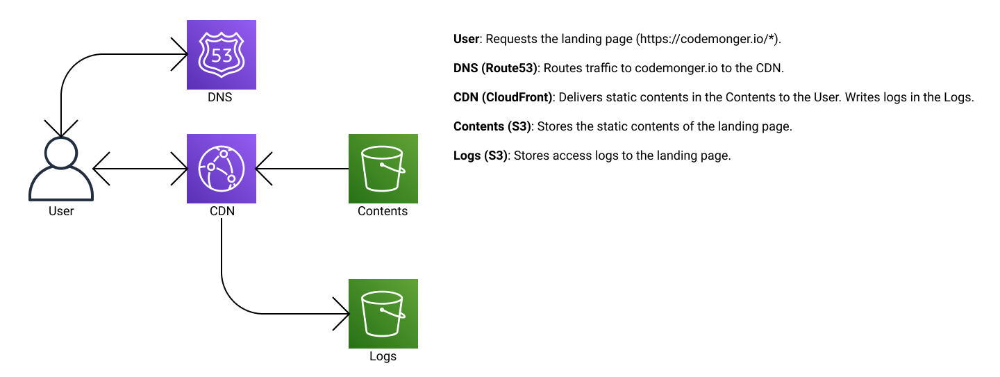

# Deploying Landing Page

The landing page is hosted on AWS.
Here is the overview of the architecture.



## Obtaining a public certificate

To route traffic to the domain (`codemonger.io`) to a CloudFront distribution, a public certificate that proves the ownership of the domain has to be assigned to the CloudFront distribution.
Please request the Amazon Certificate Manager (ACM) for a public certificate that includes at least the domain `codemonger.io`.
Suppose the ARN of the certificate is stored in `$DOMAIN_CERTIFICATE_ARN`.

**NOTE**: a public certificate for a CloudFront distribution must be created in the region `us-east-1` (N. Virginia) of the same account.

References
- [Request a Public Certificate (ACM user guide)](https://docs.aws.amazon.com/acm/latest/userguide/gs-acm-request-public.html)
- [AcmCertificateArn property (CloudFormation user guide)](https://docs.aws.amazon.com/AWSCloudFormation/latest/UserGuide/aws-properties-cloudfront-distribution-viewercertificate.html#cfn-cloudfront-distribution-viewercertificate-acmcertificatearn)

## Provisioning resources

Resources are provisioned with a [CloudFormation](https://aws.amazon.com/cloudformation/) template.
Please take the following steps,

1. Deploy [`landing-page.yaml`](landing-page.yaml).

    ```
    aws cloudformation deploy --template-file landing-page.yaml --stack-name codemonger-landing-page --parameter-overrides LandingPageDomainCertificateArn=$DOMAIN_CERTIFICATE_ARN
    ```

   You have to supply a proper credential.

2. Remember the bucket name as `STATIC_CONTENTS_BUCKET`.

    ```
    STATIC_CONTENTS_BUCKET=`aws --query "Stacks[0].Outputs[?OutputKey=='CodeMongerLandingPageBucketName']|[0].OutputValue" cloudformation describe-stacks --stack-name codemonger-landing-page | sed -E 's/^"|"$//g'`
    ```

   You have to supply a proper credential.

## Uploading contents

Upload the contents of the [`../docs`](../docs) directory.

```
aws s3 cp --recursive ../docs/ s3://$STATIC_CONTENTS_BUCKET/
```

You have to supply a proper credential.

## Route traffic to the CloudFront

Please setup aliases according to [the guide](https://docs.aws.amazon.com/Route53/latest/DeveloperGuide/resource-record-sets-values-alias.html).