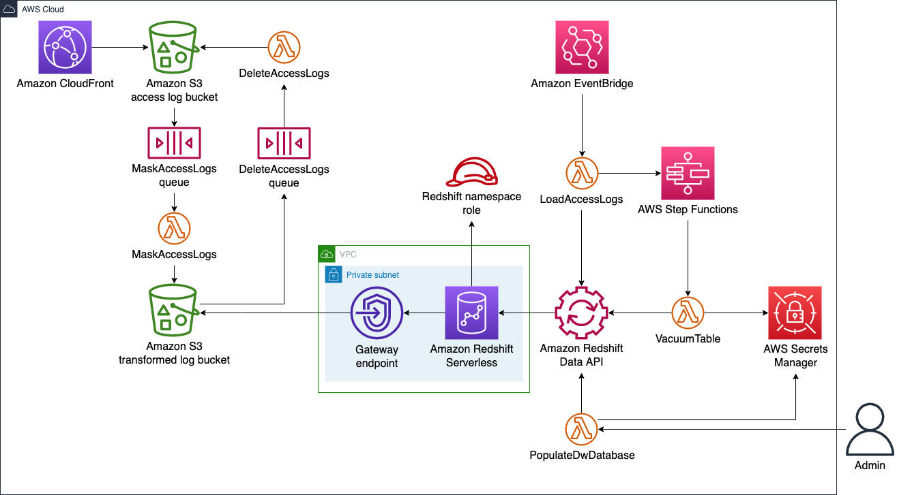

English / 日本語

# Data warehouse for access logs

This CDK stack provisions a data warehouse for access logs.
The data warehouse is backed by [Amazon Redshift Serverless](https://aws.amazon.com/redshift/redshift-serverless/).

## AWS architecture

The following diagram shows the AWS architecture of the data warehouse.

### Amazon CloudFront

`Amazon CloudFront` distributes the contents of our website and saves access logs in [`Amazon S3 access log bucket`](#amazon-s3-access-log-bucket).

### Amazon S3 access log bucket

`Amazon S3 access log bucket` is an [Amazon S3 (S3)](https://aws.amazon.com/s3/) bucket that stores access logs created by [`Amazon CloudFront`](#amazon-cloudfront).
This bucket sends an event to [`MaskAccessLogs queue`](#maskaccesslogs-queue) when an access logs file is PUT into this bucket.

### MaskAccessLogs queue

`MaskAccessLogs queue` is an [Amazon Simple Queue Service (SQS)](https://docs.aws.amazon.com/AWSSimpleQueueService/latest/SQSDeveloperGuide/welcome.html) queue that invokes [`MaskAccessLogs`](#maskaccesslogs).
[`Amazon S3 access log bucket`](#amazon-s3-access-log-bucket) sends an event to this queue when an access logs file is PUT into the bucket.

### MaskAccessLogs

`MaskAccessLogs` is an [AWS Lambda (Lambda)](https://docs.aws.amazon.com/lambda/latest/dg/welcome.html) function that transforms access logs in [`Amazon S3 access log bucket`](#amazon-s3-access-log-bucket).
This function masks IP addresses, `c-ip` and `x-forwarded-for`, in the [CloudFront access logs](https://docs.aws.amazon.com/AmazonCloudFront/latest/DeveloperGuide/AccessLogs.html#LogFileFormat).
This function also introduces a new column of row numbers to retain the order of the access log records.
This function saves transformed results in [`Amazon S3 transformed log bucket`](#amazon-s3-transformed-log-bucket).
While [`Amazon S3 access log bucket`](#amazon-s3-access-log-bucket) spreads access logs files flat, this function creates a folder hierarchy corresponding to the year, month, and day of access log records.
This folder structure helps [`LoadAccessLogs`](#loadaccesslogs) to process access logs on a specific date in a batch.

### Amazon S3 transformed log bucket

`Amazon S3 transformed log bucket` is an S3 bucket that stores access logs transformed by [`MaskAccessLogs`](#maskaccesslogs).
This bucket sends an event to [`DeleteAccessLogs queue`](#deleteaccesslogs-queue) when a transformed access logs file is PUT into this bucket.

### DeleteAccessLogs queue

`DeleteAccessLogs queue` is an SQS queue that invokes [`DeleteAccessLogs`](#deleteaccesslogs).
[`Amazon S3 transformed log bucket`](#amazon-s3-transformed-log-bucket) sends an event to this queue when a transformed access logs file is PUT into the bucket.

### DeleteAccessLogs

`DeleteAccessLogs` is a Lambda function that deletes an access logs file in [`Amazon S3 access log bucket`](#amazon-s3-access-log-bucket), which has been transformed by [`MaskAccessLogs`](#maskaccesslogs) and saved in [`Amazon S3 transformed log bucket`](#amazon-s3-transformed-log-bucket).

### Amazon Redshift Serverless

`Amazon Redshift Serverless` is a bundle of [Amazon Redshift Serverless](https://aws.amazon.com/redshift/) resources, which is the core of the data warehouse.
It has one [fact table](https://en.wikipedia.org/wiki/Fact_table),
- `access_log`

and five [dimension tables](https://en.wikipedia.org/wiki/Dimension_(data_warehouse)),
- `referer`
- `page`
- `edge_location`
- `user_agent`
- `result_type`

Nodes of `Amazon Redshift Serverless` reside in a private subnet.
Lambda functions, [`PopulateDwDatabase`](#populatedwdatabase), [`LoadAccessLogs`](#loadaccesslogs), and [`VacuumTable`](#vacuumtable) operate `Amazon Redshift Serverless` via [`Amazon Redshift Data API`](#amazon-redshift-data-api).

The default role of the Amazon Redshift Serverless namespace ([`Redshift namespace role`](#redshift-namespace-role)) can read objects from [`Amazon S3 transformed log bucket`](#amazon-s3-transformed-log-bucket).
`Amazon Redshift Serverless` accesses [`Amazon S3 transformed log bucket`](#amazon-s3-transformed-log-bucket) through [`Gateway endpoint`](#gateway-endpoint).

This CDK stack creates an admin user when it provisions `Amazon Redshift Serverless`.
[`AWS Secrets Manager`](#aws-secrets-manager) generates and manages the password of the admin user.

### Redshift namespace role

`Redshift namespace role` is an [AWS Identity and Access Management (IAM)](https://docs.aws.amazon.com/IAM/latest/UserGuide/introduction.html) role that is the default role of the namespace of [`Amazon Redshift Serverless`](#amazon-redshift-serverless) and can read objects from [`Amazon S3 transformed log bucket`](#amazon-s3-transformed-log-bucket).

### Gateway endpoint

`Gateway endpoint` ensures traffic between [`Amazon Redshift Serverless`](#amazon-redshift-serverless) and [`Amazon S3 transformed log bucket`](#amazon-s3-transformed-log-bucket) never goes through the Internet.
Please refer to ["Enhanced VPC routing in Amazon Redshift" - *Amazon Redshift Management Guide*](https://docs.aws.amazon.com/redshift/latest/mgmt/enhanced-vpc-routing.html) for more details.

### AWS Secrets Manager

`AWS Secrets Manager` generates and manages the password of the admin user of [`Amazon Redshift Serverless`](#amazon-redshift-serverless).
Please refer to [*AWS Secrets Manager User Guide*](https://docs.aws.amazon.com/secretsmanager/latest/userguide/intro.html).

Unfortunately, the secret managed by `AWS Secrets Manager` does not sync with the admin password of [`Amazon Redshift Serverless`](#amazon-redshift-serverless) except for the first time it is generated.
So you have to manually reset the admin password of [`Amazon Redshift Serverless`](#amazon-redshift-serverless) in case `AWS Secrets Manager` generates a new secret.

### Amazon Redshift Data API

`Amazon Redshift Data API` relieves clients of [`Amazon Redshift Serverless`](#amazon-redshift-serverless) of managing connections to the database.
Please refer to ["Using the Amazon Redshift Data API" - *Amazon Redshift Management Guide*](https://docs.aws.amazon.com/redshift/latest/mgmt/data-api.html) for more details.

### PopulateDwDatabase

`PopulateDwDatabase` is a Lambda function that populates the database and tables to store access logs on [`Amazon Redshift Serverless`](#amazon-redshift-serverless).
This function obtains the admin credentials of [`Amazon Redshift Serverless`](#amazon-redshift-serverless) from [`AWS Secrets Manager`](#aws-secrets-manager).
The administrator (`Admin`) has to run this function after deploying this CDK stack.

### Amazon EventBridge

`Amazon EventBridge` defines an [Amazon EventBridge rule](https://docs.aws.amazon.com/eventbridge/latest/userguide/eb-create-rule-schedule.html) that runs [`LoadAccessLogs`](#loadaccesslogs) every 2 AM in UTC.

### LoadAccessLogs

`LoadAccessLogs` is a Lambda function that loads access logs on a specific date onto [`Amazon Redshift Serverless`](#amazon-redshift-serverless).
This function executes [`AWS Step Functions`](#aws-step-functions) after the access log loading finishes.
[`Amazon EventBridge`](#amazon-eventbridge) runs this function once a day.

While this function is intended to be invoked by [`Amazon EventBridge`](#amazon-eventbridge), you can also manually run this function with a proper payload.

### AWS Step Functions

`AWS Step Functions` defines an [AWS Step Functions state machine](https://docs.aws.amazon.com/step-functions/latest/dg/welcome.html) that runs [`VacuumTable`](#vacuumtable) over every table on [`Amazon Redshift Serverless`](#amazon-redshift-serverless); `access_log`, `referer`, `page`, `edge_location`, `user_agent`, and `result_type`.
Since only a single execution of the [`VACUUM` SQL command](https://docs.aws.amazon.com/redshift/latest/dg/r_VACUUM_command.html) is allowed at once, `AWS Step Functions` processes tables with [`VacuumTable`](#vacuumtable) one by one.

### VacuumTable

`VacuumTable` is a Lambda function that runs the [`VACUUM` SQL command](https://docs.aws.amazon.com/redshift/latest/dg/r_VACUUM_command.html) over a specified table.
This function obtains the admin credentials of [`Amazon Redshift Serverless`](#amazon-redshift-serverless) from [`AWS Secrets Manager`](#aws-secrets-manager).