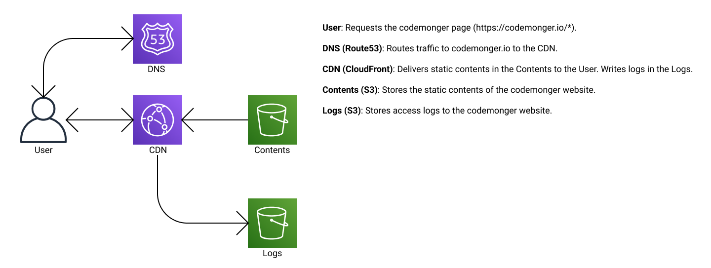

[English](./README.md) / 日本語

# codemongerのCDKスタック

これはcodemongerウェブサイト(https://codemonger.io)のためのAWSリソースを確保する[Cloud Development Kit (CDK)](https://docs.aws.amazon.com/cdk/v2/guide/home.html)スタックです。

このスタックはCDKバージョン2で記述されています。

以下はアーキテクチャの概要です。


## 事前準備

### Node.jsをインストールする

[Node.js](https://nodejs.org/en/)をインストールする必要があります。
バージョンv16.xなら大丈夫なはずです。

### codemonger.ioのSSL/TLS公開証明書を取得する

ドメイン名`codemonger.io`を使うには、ドメインの所有を証明するSSL/TLS公開証明書が必要です。
このプロジェクトは[AWS Certificate Manager (ACM)](https://docs.aws.amazon.com/acm/latest/userguide/acm-overview.html)を介して公開証明書を要求・取得し、証明書のARNが`lib/certificate-config.ts`ファイルに以下のように保存されているものと想定しています。

```ts
export const CODEMONGER_DOMAIN_NAME = 'codemonger.io';
export const CODEMONGER_CERTIFICATE_ARN = 'arn:aws:acm:us-east-1:{ACCOUNT_ID}:certificate/{CERTIFICATE_ID}';
```

`lib/certificate-config.ts`はこのレポジトリにプッシュしませんのでご注意ください。

## CDKスタックをいじる

### 依存関係を解決する

開発を始める前に依存関係を解決しなければなりません。

```sh
npm install
```

### AWS_PROFILEを設定する

このドキュメントは適切なクレデンシャルの設定されたAWSプロファイルが[`AWS_PROFILE`](https://docs.aws.amazon.com/cli/latest/userguide/cli-configure-profiles.html)環境変数に格納されているものと想定しています。
以下は私の場合の例です。

```sh
export AWS_PROFILE=codemonger-jp
```

### ツールキットスタック名を設定する

CDKはいくつかのアセットを[ブートストラップ](https://docs.aws.amazon.com/cdk/v2/guide/bootstrapping.html)で作成されるツールキットスタックに確保します。
デフォルトのツールキットスタック名は`"CDKToolkit"`なので、異なるプロジェクトのすべてのアセットがそこに放り込まれてしまいます。
私はひとつの場所に全部を混ぜこぜにするのは好きではないので、プロジェクトごとに別のツールキットスタック名を使いたいです。
このプロジェクトはツールキットスタック名が`"codemonger-toolkit-stack"`であり`TOOLKIT_STACK_NAME`変数に格納されているものと想定しています。

```sh
TOOLKIT_STACK_NAME=codemonger-toolkit-stack
```

### Synthesizer Qualifierを設定する

CDKバージョン2は[Qualifier](https://docs.aws.amazon.com/cdk/v2/guide/bootstrapping.html#bootstrapping-custom-synth)をツールキットスタックに割り当てます(デフォルトで`"hnb659fds"`)。
CDKはいくつかのツールキットリソースをQualiferでのみ区別できる物理名で確保するので、ツールキットスタックを他のプロジェクトから分離するにはユニークなQualifierを割り当てなければなりません。

このドキュメントはQualifierが`"cdmngr2022"`で`TOOLKIT_STACK_QUALIFIER`変数に格納されているものと想定しています。

```sh
TOOLKIT_STACK_QUALIFIER=cdmngr2022
```

QualifierはS3バケット名に含まれるので、S3バケット名に使用可能な文字のみ使わなければなりません。例えば、大文字は使えません。
そして最大10文字までです。

### ツールキットスタックを確保する

このステップは開発を始める最初に**一度だけ**必要です。

```sh
npx cdk bootstrap --toolkit-stack-name $TOOLKIT_STACK_NAME --qualifier $TOOLKIT_STACK_QUALIFIER
```

詳しくは[CDKのドキュメント(Bootstrapping)](https://docs.aws.amazon.com/cdk/v2/guide/bootstrapping.html)をご覧ください。

### CloudFormationテンプレートを合成する

CDKスタックをデプロイする前に、どのような[CloudFormation](https://docs.aws.amazon.com/AWSCloudFormation/latest/UserGuide/Welcome.html)テンプレートがデプロイされるのかを確認したいかもしれません。
`cdk synth`コマンドはCloudFormationテンプレートをデプロイせずに出力します。

```sh
npx cdk synth -c "@aws-cdk/core:bootstrapQualifier=$TOOLKIT_STACK_QUALIFIER"
```

上記のコマンドはCloudFormationテンプレートを開発ステージ用に出力します。
製品ステージ用のものが欲しい場合は、CDKコンテキスト`codemonger:stage`に`"production"`を指定してください。

```sh
npx cdk synth -c "@aws-cdk/core:bootstrapQualifier=$TOOLKIT_STACK_QUALIFIER" -c codemonger:stage=production
```

### CDKスタックをデプロイする

`cdk deploy`コマンドはCDKスタックを[`AWS_PROFILE`環境変数](#setting-awsprofile)に紐づくAWSアカウントにデプロイします。

```sh
npx cdk deploy --toolkit-stack-name $TOOLKIT_STACK_NAME -c "@aws-cdk/core:bootstrapQualifier=$TOOLKIT_STACK_QUALIFIER"
```

上記のコマンドは開発用のCDKスタックをデプロイします。
製品用のCDKスタックをデプロイしたい場合は、CDKコンテキスト`codemonger:stage`に`"production"`を指定してください。

```sh
npx cdk deploy --toolkit-stack-name $TOOLKIT_STACK_NAME -c "@aws-cdk/core:bootstrapQualifier=$TOOLKIT_STACK_QUALIFIER" -c codemonger:stage=production
```

CDKスタックをデプロイしたら、以下のCloudFormationスタックが作成・更新されるはずです。
- `codemonger-development` (開発ステージ)
- `codemonger-production` (製品ステージ)

#### ドメイン名なしで製品用スタックをデプロイする

製品用スタックは[CloudFront](https://docs.aws.amazon.com/AmazonCloudFront/latest/DeveloperGuide/Introduction.html) Distributionをドメイン名`codemonger.io`に関連づけようとします。
しかし私の最初の試みは失敗しました。なぜならドメイン名`codemonger.io`はこのCDKスタックが作られる前に別のCloudFront Distributionに取られてしまっていたからです。
ということで[こちらに記載の特別な手順](https://docs.aws.amazon.com/AmazonCloudFront/latest/DeveloperGuide/CNAMEs.html#alternate-domain-names-move)を取らなければなりませんでした。
この手順によると、新しいCloudFront Distributionは`codemonger.io`をカバーする有効なSSL/TLS証明書を割り当てつつドメイン名は割り当てられていない設定にしなければなりませんでした。
残念ながらCDKはSSL/TLS証明書を指定するとドメイン名の指定も要求するので、最初にCloudFront Distributionをドメイン名とSSL/TLS証明書なしで確保し、それから手作業でSSL/TLS証明書を紐づけなければなりませんでした。
ということで、製品用のCloudFront Distributionをドメイン名とSSL/TLS証明書なしで確保するためのCDKコンテキスト`codemonger:no-domain-name`を用意しました。

```sh
npx cdk deploy --toolkit-stack-name $TOOLKIT_STACK_NAME -c "@aws-cdk/core:bootstrapQualifier=$TOOLKIT_STACK_QUALIFIER" -c codemonger:stage=production -c codemonger:no-domain-name=true
```

新しいCloudFront Distributionへのドメイン名の移管が成功したら、`-c codemonger:no-domain-name=true`オプションは省かなければなりません。

### コンテンツ用のS3バケット名を取得する

このCDKスタックはcodemongerウェブサイトのコンテンツを格納するための[S3](https://docs.aws.amazon.com/AmazonS3/latest/userguide/Welcome.html)バケットを確保します。
以下のコマンドはコンテンツ用のS3バケット名を出力します。

```sh
aws cloudformation describe-stacks --stack-name codemonger-$DEPLOYMENT_STAGE --query "Stacks[0].Outputs[?OutputKey=='ContentsBucketName']|[0].OutputValue" --output text
```

`$DEPLOYMENT_STAGE`を取得したいS3バケットが存在するデプロイステージで置き換えてください。
ちなみに最後の`sed`コマンドは出力を囲むダブルクオーテーションマークを削除します。

#### ウェブサイトのコンテンツをデプロイする

ウェブサイトのコンテンツをデプロイする方法については[`../zola`](../zola/README.ja.md)フォルダをご覧ください。

### CloudFront Distributionのドメイン名を取得する

このCDKスタックはcodemongerウェブサイトのコンテンツ用にCloudFront Distributionを確保します。
製品版サイトは`codemonger.io`から提供されますが裏にCloudFront Distributionがいます。
以下のコマンドはコンテンツ用のCloudFront Distributionのドメイン名を出力します。

```sh
aws cloudformation describe-stacks --stack-name codemonger-$DEPLOYMENT_STAGE --query "Stacks[0].Outputs[?OutputKey=='ContentsDistributionDomainName']|[0].OutputValue" --output text
```

`$DEPLOYMENT_STAGE`を取得したいCloudFront Distributionが存在するデプロイステージで置き換えてください。
ちなみに最後の`sed`コマンドは出力を囲むダブルクオーテーションマークを削除します。

### ユニットテストを実行する

以下のコマンドでユニットテストを実行してください。

```sh
npm test
```

以下をテストします。
- URIに`index.html`を追加する[CloudFront関数](https://docs.aws.amazon.com/AmazonCloudFront/latest/DeveloperGuide/cloudfront-functions.html)