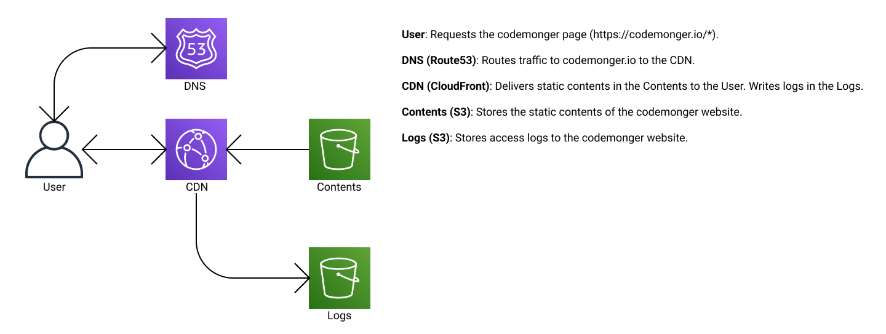

English / [日本語](./README.ja.md)

# CDK stack for codemonger

This is a [Cloud Development Kit (CDK)](https://docs.aws.amazon.com/cdk/v2/guide/home.html) stack that provisions AWS resources for the website of codemonger (https://codemonger.io).

This stack is described with the CDK version 2.

Here is the overview of the architecture.


## Prerequisites

### Installing Node.js

You need [Node.js](https://nodejs.org/en/) installed.
The version v16.x should work.

### Obtaining a public SSL/TLS certificate for codemonger.io

To use the domain name `codemonger.io`, you need a public SSL/TLS certificate that proves the ownership of the domain.
This project supposes that you have requested and obtained a public certificate via [AWS Certificate Manager (ACM)](https://docs.aws.amazon.com/acm/latest/userguide/acm-overview.html), and the ARN of the certificate is saved in the `lib/certificate-config.ts` file that should look like the following,

```ts
export const CODEMONGER_DOMAIN_NAME = 'codemonger.io';
export const CODEMONGER_CERTIFICATE_ARN = 'arn:aws:acm:us-east-1:{ACCOUNT_ID}:certificate/{CERTIFICATE_ID}';
```

Note that `lib/certificate-config.ts` is never pushed to this repository.

## Working with the CDK stack

### Resolving dependencies

You have to resolve dependencies before starting development.

```sh
npm install
```

### Setting AWS_PROFILE

This documentation supposes that an AWS profile with appropriate credentials is stored in the [`AWS_PROFILE`](https://docs.aws.amazon.com/cli/latest/userguide/cli-configure-profiles.html) environment variable.
The following is an example in my case,

```sh
export AWS_PROFILE=codemonger-jp
```

### Setting the toolkit stack name

CDK stores some assets in a toolkit stack that is created by [bootstrapping](https://docs.aws.amazon.com/cdk/v2/guide/bootstrapping.html).
Since the default toolkit stack name is `"CDKToolkit"`, all the assets from different projects are thrown into there.
Because I do not like mixing everything in one place, I prefer to use a different toolkit stack name per project.
This project supposes that the toolkit stack name is `"codemonger-toolkit-stack"` and is stored in a variable `TOOLKIT_STACK_NAME`.

```sh
TOOLKIT_STACK_NAME=codemonger-toolkit-stack
```

### Setting the synthesizer qualifier

CDK v2 assigns a [qualifier](https://docs.aws.amazon.com/cdk/v2/guide/bootstrapping.html#bootstrapping-custom-synth) to a toolkit stack, and it is `"hnb659fds"` by default.
Since CDK provisions some toolkit resources with physical names that can only be distinguished by the qualifier, you have to assign a unique qualifier for your project to separate the toolkit stack from the other projects.

This documentation supposes that the qualifier is `"cdmngr2022"` and it is stored in a variable `TOOLKIT_STACK_QUALIFIER`.

```sh
TOOLKIT_STACK_QUALIFIER=cdmngr2022
```

Note that a qualifier is included in an S3 bucket name, so you have to use only characters allowed for S3 bucket names; e.g., capital letters are not allowed.
And it must be at most 10 characters long.

### Provisioning the toolkit stack

This step is necessary **only once** when you start the development.

```sh
npx cdk bootstrap --toolkit-stack-name $TOOLKIT_STACK_NAME --qualifier $TOOLKIT_STACK_QUALIFIER
```

Please refer to the [CDK documentation (Bootstrapping)](https://docs.aws.amazon.com/cdk/v2/guide/bootstrapping.html) for more details.

### Synthesizing a CloudFormation template

Before deploying this CDK stack, you may want to check what [CloudFormation](https://docs.aws.amazon.com/AWSCloudFormation/latest/UserGuide/Welcome.html) template is going to be deployed.
`cdk synth` command outputs a CloudFormation template without deploying it.

```sh
npx cdk synth -c "@aws-cdk/core:bootstrapQualifier=$TOOLKIT_STACK_QUALIFIER"
```

The above command outputs a CloudFormation template for the development stage.
If you want one for the production stage, please specify `"production"` to the `codemonger:stage` CDK context.

```sh
npx cdk synth -c "@aws-cdk/core:bootstrapQualifier=$TOOLKIT_STACK_QUALIFIER" -c codemonger:stage=production
```

### Deploying the CDK stack

`cdk deploy` command deploys the CDK stack to the AWS account associated with the [`AWS_PROFILE` environment variable](#setting-awsprofile).

```sh
npx cdk deploy --toolkit-stack-name $TOOLKIT_STACK_NAME -c "@aws-cdk/core:bootstrapQualifier=$TOOLKIT_STACK_QUALIFIER"
```

The above command deploys the CDK stack for development.
If you want to deploy the CDK stack for production, please specify `"production"` to the `codemonger:stage` CDK context.

```sh
npx cdk deploy --toolkit-stack-name $TOOLKIT_STACK_NAME -c "@aws-cdk/core:bootstrapQualifier=$TOOLKIT_STACK_QUALIFIER" -c codemonger:stage=production
```

After deploying the CDK stack, you will find the following CloudFormation stack created or updated,
- `codemonger-development` for the development stage
- `codemonger-production` for the production stage

#### Deploying the production stack without the alternate domain name

The production stack tries to associates the [CloudFront](https://docs.aws.amazon.com/AmazonCloudFront/latest/DeveloperGuide/Introduction.html) distribution with the domain name `codemonger.io`.
But my first attempt failed because the domain name `codemonger.io` had already been taken by another CloudFront distribution before this CDK stack was created.
So I had to take [special steps described here](https://docs.aws.amazon.com/AmazonCloudFront/latest/DeveloperGuide/CNAMEs.html#alternate-domain-names-move).
According to these steps, a new CloudFront distribution had to be configured with a valid SSL/TLS certificate covering `codemonger.io` but no atlernate domain name assigned.
Unfortunately, since CDK requires a domain name specified if an SSL/TLS certificate is specified, I first had to provision a CloudFront distribution without domain name and SSL/TLS certificate, and then manually associated an SSL/TLS certificate to the CloudFront distribution.
Thus, I provided a CDK context `codemonger:no-domain-name` that provisions the CloudFront distribution for production without the domain name and SSL/TLS certificate.

```sh
npx cdk deploy --toolkit-stack-name $TOOLKIT_STACK_NAME -c "@aws-cdk/core:bootstrapQualifier=$TOOLKIT_STACK_QUALIFIER" -c codemonger:stage=production -c codemonger:no-domain-name=true
```

After successfully transferring the domain name to the new CloudFront distribution, you have to omit the `-c codemonger:no-domain-name=true` option.

### Obtaining the S3 bucket name for contents

This CDK stack provisions an [S3](https://docs.aws.amazon.com/AmazonS3/latest/userguide/Welcome.html) bucket to store contents of the codemonger website.
The following command outputs the name of the S3 bucket for contents.

```sh
aws cloudformation describe-stacks --stack-name codemonger-$DEPLOYMENT_STAGE --query "Stacks[0].Outputs[?OutputKey=='ContentsBucketName']|[0].OutputValue" --output text
```

Please replace `$DEPLOYMENT_STAGE` with the deployment stage where the S3 bucket you want resides.
The last `sed` command removes surrounding double quotation marks from the output, by the way.

#### Deploying contents of the website

Please refer to the [`../zola`](../zola) folder for how to deploy contents of the website.

### Obtaining the domain name of a CloudFront distribution

This CDK stack provisions a CloudFront distribution for contents of the codemonger website.
The production site is served through `codemonger.io` but there is a CloudFront distribution behind.
The following command outputs the domain name of the CloudFront distribution for contents.

```sh
aws cloudformation describe-stacks --stack-name codemonger-$DEPLOYMENT_STAGE --query "Stacks[0].Outputs[?OutputKey=='ContentsDistributionDomainName']|[0].OutputValue" --output text
```

Please replace `$DEPLOYMENT_STAGE` with the deployment stage where the CloudFront distribution you want resides.
The last `sed` command removes surrounding double quotation marks from the output, by the way.

### Running unit tests

Run unit tests with the following command,

```sh
npm test
```

It tests the following,
- a [CloudFront function](https://docs.aws.amazon.com/AmazonCloudFront/latest/DeveloperGuide/cloudfront-functions.html) that expands a URI with `index.html`