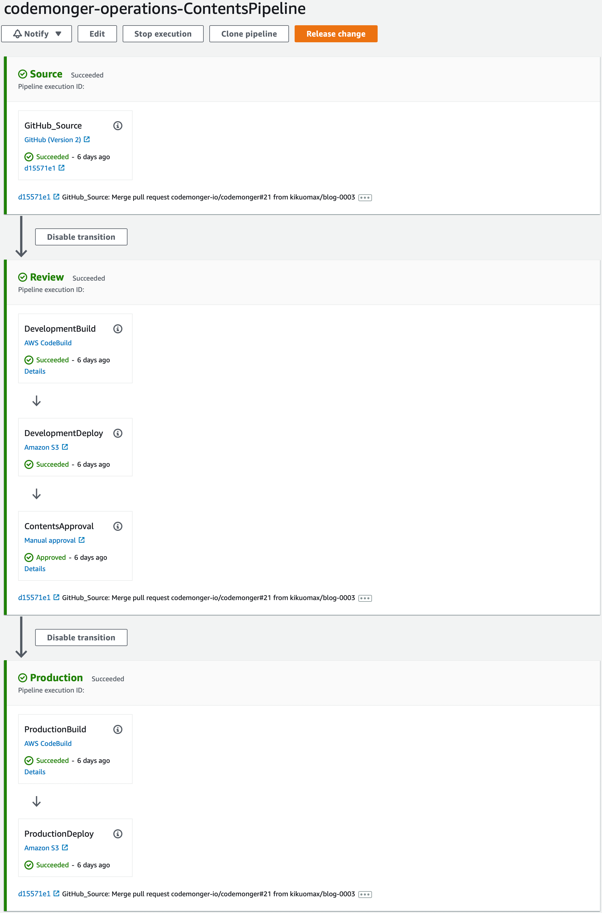
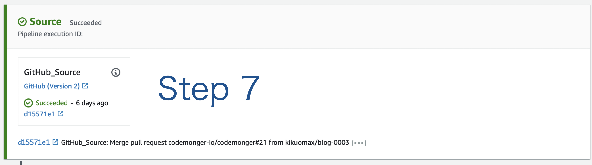
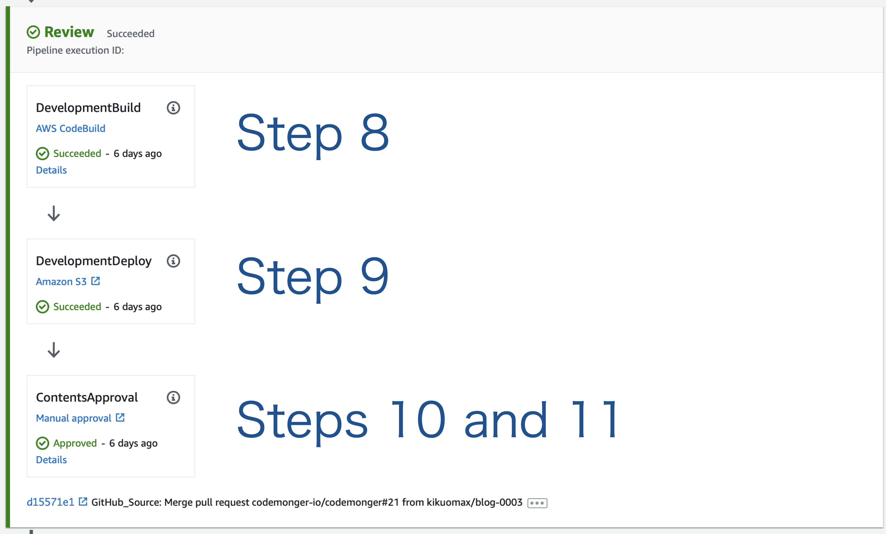
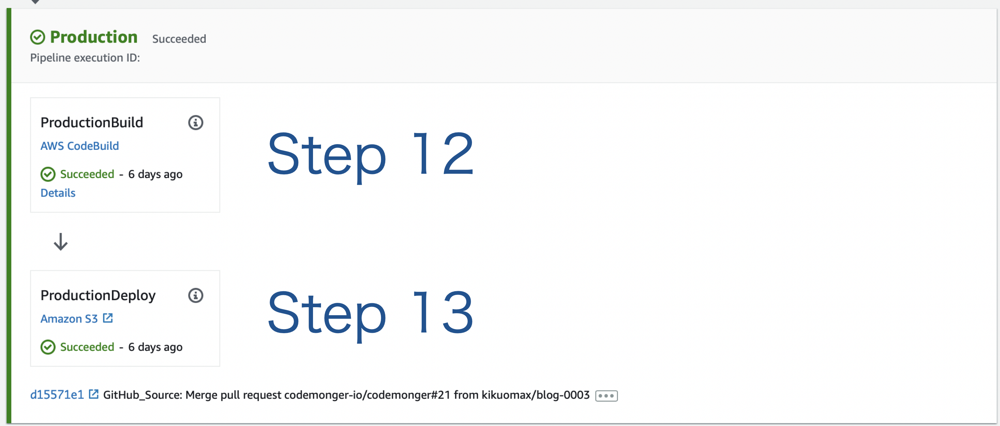
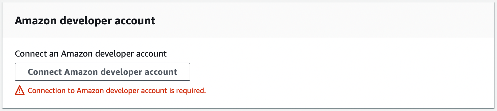
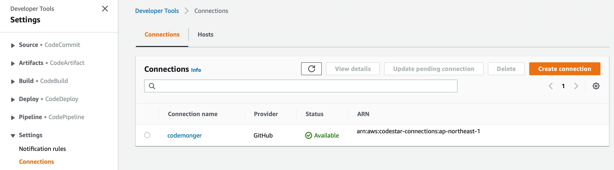

+++
title = "ウェブサイトのContinuous Delivery"
description = "このブログ投稿はコンテンツのContinuous Deliverパイプラインの設定を紹介します。"
date = 2022-07-05
draft = false
[extra]
hashtags = ["ContinuousDelivery", "AWS", "CodePipeline", "CodeBuild"]
+++

このウェブサイトのContinuous Delivery (CD)には[AWS CodePipeline](https://docs.aws.amazon.com/codepipeline/latest/userguide/welcome.html)を使っています。
このブログ投稿は私のパイプラインの設定を紹介します。

<!-- more -->

## 背景

このウェブサイトのコンテンツを更新するには、以下のステップを踏まなければなりません。
1. `zola build`で本番用のコンテンツを構築する
2. 構築したコンテンツを本番用の[Amazon S3](https://docs.aws.amazon.com/AmazonS3/latest/userguide/Welcome.html)バケットにアップロードする

上記のステップは十分シンプルで数個のコマンドで実施することができます。
それでもまだ間違いを起こす可能性があります。例えば、間違ったバケットにコンテンツをアップロードするなどです。
ということでウェブサイトの更新を自動化するのは妥当でしょう。
コンテンツのContinuous Delivery (CD)には[AWS CodePipeline](https://docs.aws.amazon.com/codepipeline/latest/userguide/welcome.html)を選択しました。

## 自動化するシナリオ

本番用にデプロイする前にコンテンツをレビューしたいところです。
そこでウェブサイトを更新するシナリオの全体は以下のステップで構成されます。
1. [`zola serve`コマンド](https://www.getzola.org/documentation/getting-started/cli-usage/#serve)を実行してコンテンツをローカルにサーブする。
2. ローカルのコンテンツをレビューする。
3. ローカルのコンテンツを承認する。
4. 作業用ブランチの変更を[GitHubレポジトリ](https://github.com/codemonger-io/codemonger)にプッシュする。
5. GitHubレポジトリの作業用ブランチから`main`ブランチにプルリクエスト(PR)を送る。
6. PRを承認しマージする。
7. GitHubレポジトリの`main`ブランチをクローンする。
8. [`zola build`コマンド](https://www.getzola.org/documentation/getting-started/cli-usage/#build)を実行して開発用のコンテンツを構築する。
9. ステップ8で構築したコンテンツを開発用のS3バケットにアップロードする。
10. 開発用のコンテンツをレビューする。
11. 更新を承認する。
12. `zola build`コマンドを実行して本番用のコンテンツを構築する。
13. ステップ12で構築したコンテンツを本番用のS3バケットにアップロードする。
14. 本番用のコンテンツをレビューする。

## パイプラインを設計する

[「自動化するシナリオ」節](#自動化するシナリオ)に記載のステップ7から13をパイプラインとして表現しました。
下記の図にパイプラインの概要を示します。

### ステージ

パイプラインは以下の3つのステージからなります。
1. [Source](#Sourceステージ)
2. [Review](#Reviewステージ)
3. [Production](#Productionステージ)

#### Sourceステージ

このステージは[「自動化するシナリオ」節](#自動化するシナリオ)記載のステップ7に対応しています。
GitHubレポジトリの`main`ブランチを更新した際にパイプラインを駆動するため[GitHub (Version 2)プロバイダ](https://docs.aws.amazon.com/codepipeline/latest/userguide/connections-github.html)を設定したSourceアクション(GitHub v2アクション)を選択しました。

GitHub v2アクションを使うために、私のAWSアカウントからGitHubアカウントへの接続を作成しなければなりませんでした。
詳しくは[「GitHub Connectionを作成する」節](#GitHub_Connectionを作成する)をご覧ください。

#### Reviewステージ

このステージは[「自動化するシナリオ」節](#自動化するシナリオ)記載のステップ8から11に対応しています。
開発用のコンテンツを構築する[CodeBuildアクション](https://docs.aws.amazon.com/codepipeline/latest/userguide/action-reference-CodeBuild.html)(ステップ8)、開発用のS3バケットに構築したコンテンツをアップロードする[Amazon S3デプロイアクション](https://docs.aws.amazon.com/codepipeline/latest/userguide/action-reference-S3Deploy.html)(ステップ9)、コンテンツをリリースする前にレビューの機会を提供する[マニュアル承認アクション](https://docs.aws.amazon.com/codepipeline/latest/userguide/approvals.html)(ステップ10, 11)を作成しました。

`zola build`を[AWS CodeBuild](https://docs.aws.amazon.com/codebuild/latest/userguide/welcome.html)で実行するには少し調査が必要でした。
詳しくは[「CodeBuildでZolaを実行する」節](#CodeBuildでZolaを実行する)をご覧ください。

#### Productionステージ

このステージは[「自動化するシナリオ」節](#自動化するシナリオ)記載のステップ12と13に対応しています。
ウェブサイトのコンテンツを本番用に構築するCodeBuildアクション(ステップ12)と構築したコンテンツを本番用のS3バケットにアップロードするAmazon S3デプロイアクション(ステップ13)を作成しました。

## GitHub Connectionを作成する

GitHubブランチが更新された際にパイプラインを駆動するには、GitHub v2アクションを使うことができます。
GitHub (Version2)プロバイダはAWSアカウントとソースのGitHubアカウント間の[AWS CodeStar](https://docs.aws.amazon.com/codestar/latest/userguide/welcome.html) Connectionを必要とします。
[このドキュメント](https://docs.aws.amazon.com/codepipeline/latest/userguide/connections-github.html#connections-github-console)にはCodePipelineコンソールもしくはAWS CLIを使用してGitHub用のCodeStar Connectionを作成する方法が説明されています。
しかし私は別の方法をとりました([AWS CodeStarコンソール](https://docs.aws.amazon.com/codestar/latest/userguide/how-to-create-project.html)を使ってCodeStar Connectionを作成)。
うまくいきましたがあまりしっくりきませんでした(私が行ったことに興味がありましたら[「CodeStarコンソールからCodeStar Connectionを作成する」節](#CodeStarコンソールからCodeStar_Connectionを作成する)をご覧ください)。
後から今回の件で最適な方法は[こちら](https://docs.aws.amazon.com/dtconsole/latest/userguide/connections-create-github.html)に記載されていることに気づいきました。

### CodeStarコンソールからCodeStar Connectionを作成する

私は"CodeStar"という文言を見るなり、CodeStarコンソールに向かいました。
CodeStar Connectionを作成するメニューが見つかると期待していましたが、そこにそのようなものはありませんでした\*。
[CodeStarのドキュメント](https://docs.aws.amazon.com/codestar/latest/userguide/welcome.html)をよく読んでみると、GitHub用のCodeStar Connectionの作成方法に関する手順が[こちらのページ](https://docs.aws.amazon.com/codestar/latest/userguide/how-to-create-project.html)(ステップ8参照)にありました。
ということで当該ページの手順に従うことにし、CodeStarプロジェクトの作成を試してみました。

CodeStarプロジェクトウィザードの指示に従うことで、GitHubアカウントに対するCodeStar Connectionを確立することができました。
しかしウィザードの最後で[Amazon Developer Account](https://developer.amazon.com/)の作成を求められ、全く納得いきませんでした。

なのでCodeStarプロジェクトの作成は中断しました。
何にせよ、GitHub用のCodeStar Connectionを作成するという第1の目標は達成できました。

\* CodeStar Connectionに関するメニューは実際のところDeveloper Toolsコンソールにあります(CodePipelineや他のCodeXYZサービスなども含まれる)。

## CodeBuildでZolaを実行する

Zolaの作者は[ZolaのDockerイメージ](https://github.com/getzola/zola/pkgs/container/zola)を公開してくれています。
残念ながら、シェル(`sh`)を含んでおらず[CodeBuildの要件](https://docs.aws.amazon.com/codebuild/latest/userguide/troubleshooting.html#troubleshooting-sh-build-images)を満たしていません。
そこで以下の2つのオプションを検討しました。
1. Zolaと`sh`を両方含む独自のDockerイメージを作成する
2. `sh`を含む既存のDockerイメージを使用しbuildspecでZolaをインストールする

Zolaは複数のLinuxディストリビューションでビルド済みのものが利用できるので2番目のオプションを選びました。
候補のディストリビューションの中でAlpine Linuxが傑出していました。人気があって非常に小さなイメージが[Amazon ECR Public Galleryで公開](https://gallery.ecr.aws/docker/library/alpine)されているからです。
ということで[Alpine LinuxにZolaをインストール](https://www.getzola.org/documentation/getting-started/installation/#alpine-linux)することにしました。

## まとめ

このウェブサイトを更新する手続き(マニュアルレビューと承認含む)を自動化するCDパイプラインを構築しました。
パイプラインをデプロイする[AWS Cloud Development Kit (CDK)](https://docs.aws.amazon.com/cdk/v2/guide/home.html)スクリプトは[私のGitHubレポジトリ](https://github.com/codemonger-io/codemonger/tree/main/cdk-ops)から利用できます。