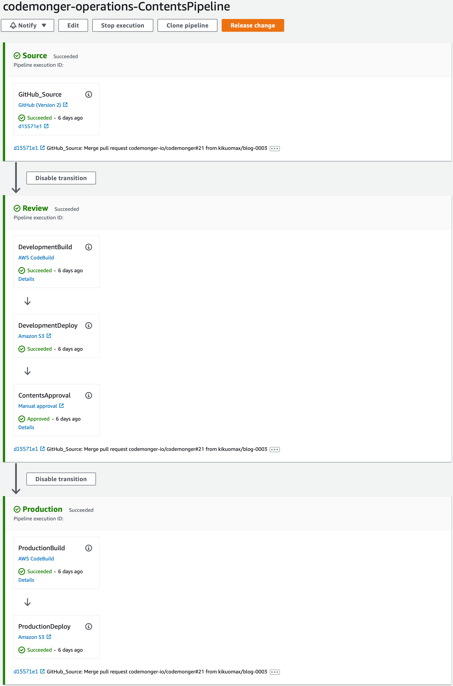
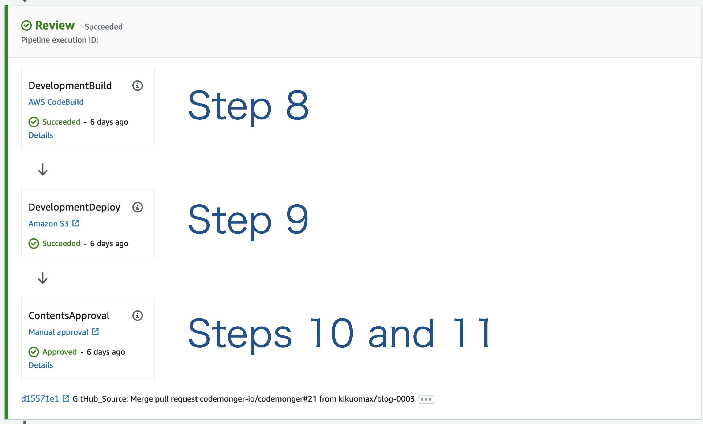

+++
title = "Continuous delivery of the website"
description = "This blog post will show you my configuration of the Continuous Delivery pipeline for the contents."
date = 2022-07-05
draft = false
[extra]
hashtags = ["ContinuousDelivery", "AWS", "CodePipeline", "CodeBuild"]
+++

I am using [AWS CodePipeline](https://docs.aws.amazon.com/codepipeline/latest/userguide/welcome.html) for Continuous Delivery (CD) of this website.
This blog post will show you my configuration of the pipeline.

<!-- more -->

## Background

To update the contents of this website, I have to take the following steps,
1. Build contents with `zola build` for production
2. Upload the built contents to the [Amazon S3](https://docs.aws.amazon.com/AmazonS3/latest/userguide/Welcome.html) bucket for production

The above steps are simple enough and I can do them with a couple of commands.
But I still can make a mistake; e.g., uploading the contents to a wrong bucket.
So it is reasonable to automate the update of the website.
I chose [AWS CodePipeline](https://docs.aws.amazon.com/codepipeline/latest/userguide/welcome.html) for Continuous Delivery (CD) of the contents.

## The scenario to be automated

I want to review the contents before deploying them for production.
So the entire scenario to update the website is consisting of the following steps,
1. Run the [`zola serve` command](https://www.getzola.org/documentation/getting-started/cli-usage/#serve) to locally serve the contents.
2. Review the local contents.
3. Approve the local contents.
4. Push the changes to a working branch of the [GitHub repository](https://github.com/codemonger-io/codemonger).
5. Send a pull request (PR) from the working branch to the `main` branch of the GitHub repository.
6. Approve and merge the PR.
7. Clone the `main` branch of the GitHub repository.
8. Run the [`zola build` command](https://www.getzola.org/documentation/getting-started/cli-usage/#build) to build the contents for development.
9. Upload the contents built at step 8 to the S3 bucket for development.
10. Review the development contents.
11. Approve the updates.
12. Run the `zola build` command to build the contents for production.
13. Upload the contents built at step 12 to the S3 bucket for production.
14. Review the production contents.

## Designing a pipeline

I translated steps 7 through 13 described in the [section _The scenario to be automated_](#The_scenario_to_be_automated) into a pipeline.
The following diagram shows the overview of the pipeline.

### Stages

My pipeline has the following three stages,
1. [Source](#Source_stage)
2. [Review](#Review_stage)
3. [Production](#Production_stage)

#### Source stage

This stage corresponds to step 7 described in the [section _The scenario to be automated_](#The_scenario_to_be_automated).
I chose a source action with the [GitHub (Version 2) provider](https://docs.aws.amazon.com/codepipeline/latest/userguide/connections-github.html) (GitHub v2 action) to trigger the pipeline when I update the `main` branch of the GitHub repository.

To use the GitHub v2 action, I had to create a connection from my AWS account to my GitHub account.
Please refer to the [section _Creating a GitHub connection_](#Creating_a_GitHub_connection) for more details.

#### Review stage

This stage corresponds to steps 8 through 11 described in the [section _The scenario to be automated_](#The_scenario_to_be_automated).
I made a [CodeBuild action](https://docs.aws.amazon.com/codepipeline/latest/userguide/action-reference-CodeBuild.html) that builds the contents of the website for development (step 8), an [Amazon S3 deploy action](https://docs.aws.amazon.com/codepipeline/latest/userguide/action-reference-S3Deploy.html) that uploads the built contents to the S3 bucket for development (step 9), and a [manual approval action](https://docs.aws.amazon.com/codepipeline/latest/userguide/approvals.html) that provides an opportunity to review the contents before releasing them (steps 10 and 11).

I had to do some research to run `zola build` in the context of [AWS CodeBuild](https://docs.aws.amazon.com/codebuild/latest/userguide/welcome.html).
Please refer to the [section _Running Zola in the context of CodeBuild_](#Running_Zola_in_the_context_of_CodeBuild) for more details.

#### Production stage

This stage corresponds to steps 12 and 13 described in the [section _The scenario to be automated_](#The_scenario_to_be_automated).
I made a CodeBuild action that builds the contents of the website for production (step 12) and an Amazon S3 deploy action that uploads the built contents to the S3 bucket for production (step 13).

## Creating a GitHub connection

To trigger a pipeline when a GitHub branch is updated, we can use a GitHub (Version 2) action.
A GitHub (Version2) provider needs an [AWS CodeStar](https://docs.aws.amazon.com/codestar/latest/userguide/welcome.html) connection between the AWS account and the source GitHub account.
[This document](https://docs.aws.amazon.com/codepipeline/latest/userguide/connections-github.html#connections-github-console) explains how to create a CodeStar connection for GitHub using the CodePipeline console or using the AWS CLI.
However, I took a different pathway; I created a CodeStar connection using the [AWS CodeStar console](https://docs.aws.amazon.com/codestar/latest/userguide/how-to-create-project.html).
It worked but did not make much sense to me (please see the [section _Creating a CodeStar connection from the CodeStar console_](#Creating_a_CodeStar_connection_from_the_CodeStar_console) if you are interested in what I did).
Later, I found that the most suitable way for this case was described [here](https://docs.aws.amazon.com/dtconsole/latest/userguide/connections-create-github.html).

### Creating a CodeStar connection from the CodeStar console

As soon as I saw the word "CodeStar," I headed for the CodeStar console.
Although I expected I could find a menu to create a CodeStar connection, there was no such thing\*.
After looking into the [CodeStar documentation](https://docs.aws.amazon.com/codestar/latest/userguide/welcome.html), I found an instruction on how to create a CodeStar connection for GitHub on [this page](https://docs.aws.amazon.com/codestar/latest/userguide/how-to-create-project.html) (please see step 8).
So I decided to follow the instruction on the page and tried to create a CodeStar project.

By following the instructions of the CodeStar project wizard, I was able to establish a CodeStar connection to my GitHub account.
But I was required to create an [Amazon developer account](https://developer.amazon.com/) at the end of the wizard, which did not make sense at all.

So I aborted the creation of a CodeStar project.
Anyway, I achieved my primary goal to create a CodeStar connection for GitHub.

\* The menu for CodeStar connections actually resides in the Developer Tools console which also includes CodePipeline and other CodeXYZ services.

## Running Zola in the context of CodeBuild

The author of Zola has published a [Docker image of Zola](https://github.com/getzola/zola/pkgs/container/zola).
Unfortunately, it does not satisfy the [requirement of CodeBuild](https://docs.aws.amazon.com/codebuild/latest/userguide/troubleshooting.html#troubleshooting-sh-build-images), because it contains no bourne shell (`sh`).
So I considered the following two options,
1. To build my own Docker image containing both Zola and `sh`
2. To use an existing Docker image containing `sh` and install Zola in the buildspec

I chose the second option because Zola is available prebuilt on several Linux distributions.
Alpine Linux stood out in the candidate distributions as it was popular and a very small image of [it was published on Amazon ECR Public Gallery](https://gallery.ecr.aws/docker/library/alpine).
So I decided to [install Zola on top of Alpine Linux](https://www.getzola.org/documentation/getting-started/installation/#alpine-linux).

## Wrap-up

I built a CD pipeline that automates my procedure, including manual review and approval, to update this website.
The [AWS Cloud Development Kit (CDK)](https://docs.aws.amazon.com/cdk/v2/guide/home.html) scripts that deploy the pipeline are available on [my GitHub repository](https://github.com/codemonger-io/codemonger/tree/main/cdk-ops).