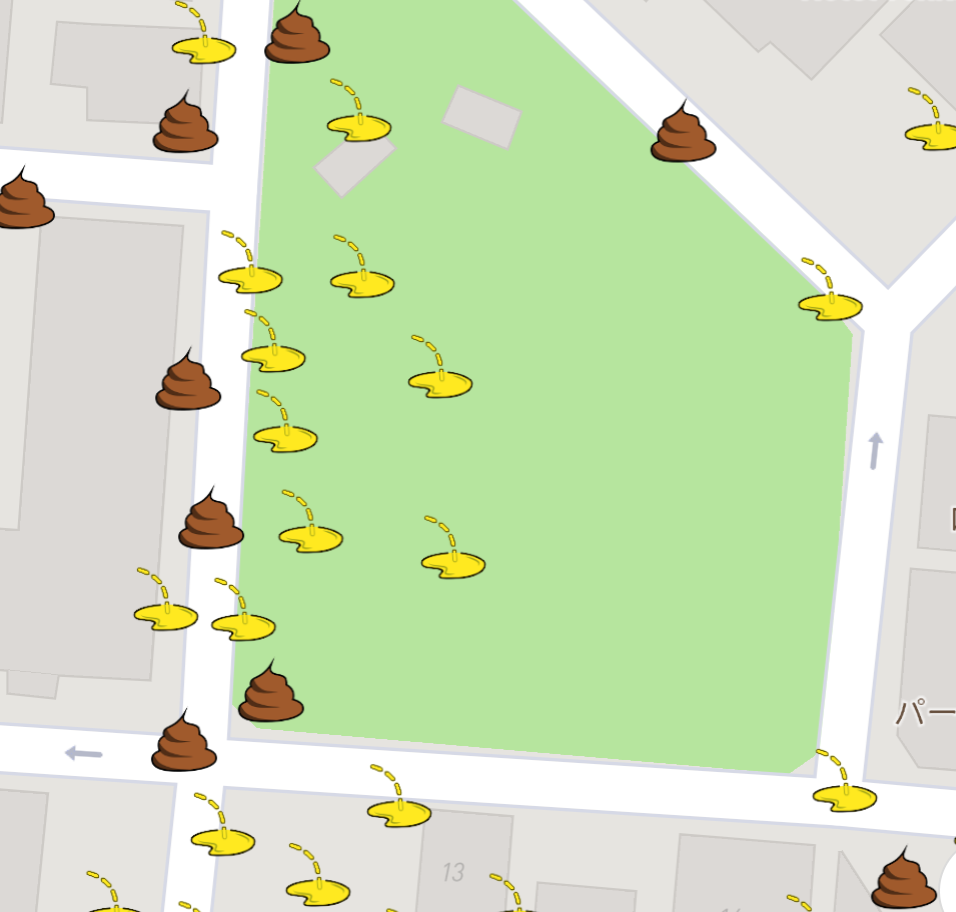
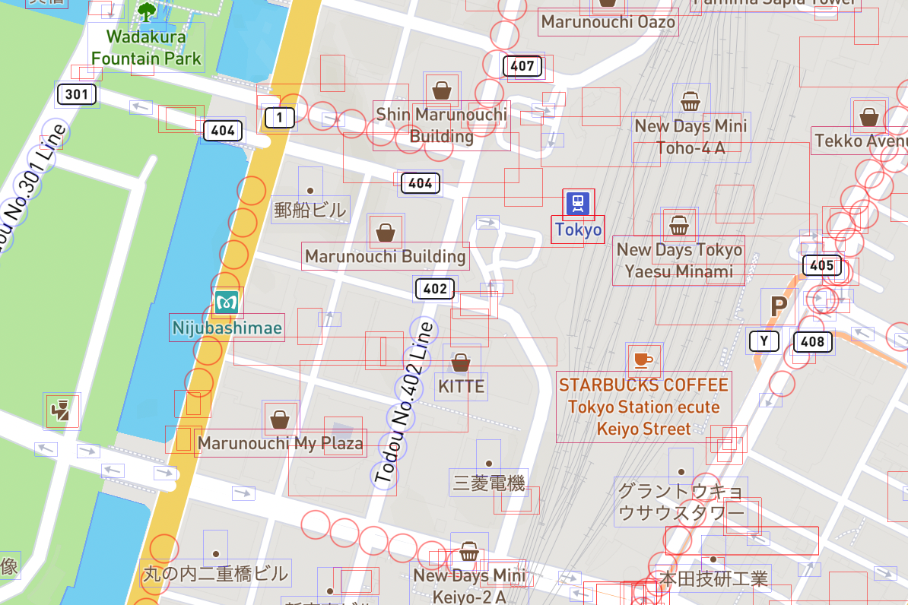

+++
title = "Dealing with Mapbox hidden symbols (1. Collision box)"
description = "Series: About development of a library that deals with Mapbox hidden symbols"
date = 2022-08-20
draft = false
[extra]
hashtags = ["Mapbox", "mapbox-gl-js"]
thumbnail_name = "thumbnail.png"
+++

I have been working on a utility library for [Mapbox GL JS](https://docs.mapbox.com/mapbox-gl-js/guides/), that deals with symbols hidden by another symbol on the screen.
This is the first blog post of the series that will walk you through the development of the library.

<!-- more -->

## Background

[Mapbox GL JS (`mapbox-gl-js`)](https://docs.mapbox.com/mapbox-gl-js/guides/) is a JavaScript library to display [Mapbox](https://www.mapbox.com) maps on a web browser.
`mapbox-gl-js` is a proprietary library of Mapbox, though it is open-sourced and we can still modify it as long as we stick to their Terms of Service.

We can show custom symbols at points on a map using [symbol layers](https://docs.mapbox.com/mapbox-gl-js/style-spec/layers/#symbol).
The following image is a screenshot from an app I am developing; icons of droppings are "symbols".


When symbols overlap on the screen, `mapbox-gl-js` shows only the first one and hides other overlapping ones.
As far as I know, there is no `mapbox-gl-js` API to get symbols hidden by a specific symbol on the screen\*.
This is not convenient for my app because it wants to list all the symbols including hidden ones at a clicked point.
Although there is an [option](https://docs.mapbox.com/mapbox-gl-js/style-spec/layers/#layout-symbol-icon-allow-overlap) that makes `mapbox-gl-js` skip collision detection and show every single symbol on the screen, this will make the map too busy if there are many overlapping symbols.

So I decided to **develop a library that can aggregate symbols overlapping with a specific symbol on a Mapbox map**.

\* [`Map#queryRenderedFeatures`](https://docs.mapbox.com/mapbox-gl-js/api/map/#map#queryrenderedfeatures) returns only visible symbols (features) but no hidden features.
[`"click"`](https://docs.mapbox.com/mapbox-gl-js/api/map/#map.event:click) event neither tells about hidden features.

## Requirements for the library

With the library I am developing, we **can query symbols intersecting with a given box on a specified layer whether symbols are visible or not**.

On top of the above feature, we **can query symbols hidden by a clicked symbol on a specified layer**.

To simplify the problem, we only consider symbols without a label (text); i.e., **icons only**.

## Collision detection

`mapbox-gl-js` does collision detection to determine which symbols it renders on the screen.
If you turn on the property [`Map#showCollisionBoxes`](https://docs.mapbox.com/mapbox-gl-js/api/map/#map#showcollisionboxes), `mapbox-gl-js` visualizes collision boxes of all the visible and hidden symbols on the screen.
The following is an example of showing collision boxes (and circles) on a Mapbox map.


If we can obtain the positions and dimensions of these collision boxes along with symbol [features](#Feature) from `mapbox-gl-js`, we can implement the library.

## Getting collision boxes

Let's walk through the [source code of `mapbox-gl-js`](https://github.com/mapbox/mapbox-gl-js/tree/v2.9.2)\* to see if we can get collision boxes.

\* I have analyzed the then latest [version 2.9.2](https://github.com/mapbox/mapbox-gl-js/tree/v2.9.2).

### Collision boxes for debugging

Can we access the same information of collision boxes rendered when we turn on [`Map#showCollisionBoxes`](https://docs.mapbox.com/mapbox-gl-js/api/map/#map#showcollisionboxes) in a production environment where [`Map#showCollisionBoxes`](https://docs.mapbox.com/mapbox-gl-js/api/map/#map#showcollisionboxes) is `false`?
Unfortunately, the answer is **no**.

[`SymbolBucket#textCollisionBox`](#SymbolBucket#textCollisionBox) and [`SymbolBucket#iconCollisionBox`](#SymbolBucket#iconCollisionBox) contain the information of all the rendered collision boxes.
[`SymbolBucket#updateCollisionBuffers`](#SymbolBucket#updateCollisionBuffers) updates [`SymbolBucket#textCollisionBox`](#SymbolBucket#textCollisionBox) and [`SymbolBucket#iconCollisionBox`](#SymbolBucket#iconCollisionBox), and [`Placement#placeLayerBucketPart`](#Placement#placeLayerBucketPart) calls it in [symbol/placement.js#L435-L437](https://github.com/mapbox/mapbox-gl-js/blob/e29e113ff5e1f4c073f84b8cbe546006d2fb604f/src/symbol/placement.js#L435-L437):
```js
        if (showCollisionBoxes && updateCollisionBoxIfNecessary) {
            bucket.updateCollisionDebugBuffers(this.transform.zoom, collisionBoxArray);
        }
```

As you can see in the above code, the method is called only if `showCollisionBoxes` (= [`Map#showCollisionBoxes`](https://docs.mapbox.com/mapbox-gl-js/api/map/#map#showcollisionboxes)) is `true`.
Since [`Map#showCollisionBoxes`](https://docs.mapbox.com/mapbox-gl-js/api/map/#map#showcollisionboxes) must be `false` for production, we cannot rely on [`SymbolBucket#textCollisionBox`](#SymbolBucket#textCollisionBox) and [`SymbolBucket#iconCollisionBox`](#SymbolBucket#iconCollisionBox).
Even if we could utilize them, we still had to project them to the screen coordinate because they are in the [tile coordinates](#Tile_coordinate_(space)).

### Another source of collision boxes

[`Placement#placeLayerBucketPart`](#Placement#placeLayerBucketPart) is responsible for collision detection of symbols.
The internal function [`placeSymbol`](#Placement#placeLayerBucketPart.placeSymbol) processes each symbol.
It calls its internal function [`placeIconFeature`](#Placement#placeLayerBucketPart.placeSymbol.placeIconFeature) to test if the icon collides with other preceding symbols on the screen.
[`placeIconFeature`](#Placement#placeLayerBucketPart.placeSymbol.placeIconFeature) calls [`CollisionIndex#placeCollisionBox`](#CollisionIndex#placeCollisionBox) in [symbol/placement.js#L709-L710](https://github.com/mapbox/mapbox-gl-js/blob/e29e113ff5e1f4c073f84b8cbe546006d2fb604f/src/symbol/placement.js#L709-L710), and it does actual collision tests:
```js
                    return this.collisionIndex.placeCollisionBox(bucket, iconScale, iconBox, shiftPoint,
                        iconAllowOverlap, textPixelRatio, posMatrix, collisionGroup.predicate);
```

If no collision is detected, [`placeSymbol`](#Placement#placeLayerBucketPart.placeSymbol) remembers the collision box of the symbol with [`CollisionIndex#insertCollisionBox`](#CollisionIndex#insertCollisionBox).
Unfortunately, it does not record the collision boxes of symbols that collide with other preceding collision boxes.
So we have to recalculate the collision boxes of those symbols.

Thus, let's look into [`CollisionIndex#placeCollisionBox`](#CollisionIndex#placeCollisionBox) in the next section to understand how it calculates a collision box in the screen coordinate.

### Anatomy of CollisionIndex#placeCollisionBox

The following shows the brief workflow of [`CollisionIndex#placeCollisionBox`](#CollisionIndex#placeCollisionBox),
1. In [symbol/collision_index.js#L97-L99](https://github.com/mapbox/mapbox-gl-js/blob/e29e113ff5e1f4c073f84b8cbe546006d2fb604f/src/symbol/collision_index.js#L97-L99), obtain the position of the collision box in the [tile space](#Tile_coordinate_(space)):

    ```js
        let anchorX = collisionBox.projectedAnchorX;
        let anchorY = collisionBox.projectedAnchorY;
        let anchorZ = collisionBox.projectedAnchorZ;
    ```
2. In [symbol/collision_index.js#L104-L111](https://github.com/mapbox/mapbox-gl-js/blob/e29e113ff5e1f4c073f84b8cbe546006d2fb604f/src/symbol/collision_index.js#L104-L111), deal with the elevation:

    ```js
        if (elevation && tileID) {
            const up = bucket.getProjection().upVector(tileID.canonical, collisionBox.tileAnchorX, collisionBox.tileAnchorY);
            const upScale = bucket.getProjection().upVectorScale(tileID.canonical, this.transform.center.lat, this.transform.worldSize).metersToTile;

            anchorX += up[0] * elevation * upScale;
            anchorY += up[1] * elevation * upScale;
            anchorZ += up[2] * elevation * upScale;
        }
    ```

   Adjust `anchorX`, `anchorY`, and `anchorZ` by the elevation.
3. In [symbol/collision_index.js#L114](https://github.com/mapbox/mapbox-gl-js/blob/e29e113ff5e1f4c073f84b8cbe546006d2fb604f/src/symbol/collision_index.js#L114), project the anchor point to the screen coordinate:

    ```js
        const projectedPoint = this.projectAndGetPerspectiveRatio(posMatrix, [anchorX, anchorY, anchorZ], collisionBox.tileID, checkOcclusion, bucket.getProjection());
    ```

   [`CollisionIndex#projectAndGetPerspectiveRatio`](#CollisionIndex#projectAndGetPerspectiveRatio), in short, multiplies [`posMatrix`](#Parameter:_posMatrix) to the point (`[anchorX, anchorY, anchorZ]`) and corrects the perspective.
4. In [symbol/collision_index.js#L116-L120](https://github.com/mapbox/mapbox-gl-js/blob/e29e113ff5e1f4c073f84b8cbe546006d2fb604f/src/symbol/collision_index.js#L116-L120), scale and translate the collision box to the `projectedPoint.point`:

    ```js
        const tileToViewport = textPixelRatio * projectedPoint.perspectiveRatio;
        const tlX = (collisionBox.x1 * scale + shift.x - collisionBox.padding) * tileToViewport + projectedPoint.point.x;
        const tlY = (collisionBox.y1 * scale + shift.y - collisionBox.padding) * tileToViewport + projectedPoint.point.y;
        const brX = (collisionBox.x2 * scale + shift.x + collisionBox.padding) * tileToViewport + projectedPoint.point.x;
        const brY = (collisionBox.y2 * scale + shift.y + collisionBox.padding) * tileToViewport + projectedPoint.point.y;
    ```
5. In [symbol/collision_index.js#L125-L142](https://github.com/mapbox/mapbox-gl-js/blob/e29e113ff5e1f4c073f84b8cbe546006d2fb604f/src/symbol/collision_index.js#L125-L142), determine if the collision box (`[tlX, tlY, brX, brY]`) collides with previously recorded collision boxes.
   This step is out of our scope.

To mock the above calculation (Steps 1 to 4), we have to prepare the following parameters,
- [`collisionBox`](#Parameter:_collisionBox)
- [`posMatrix`](#Parameter:_posMatrix)
- [`elevation`](#Parameter:_elevation)
- [`textPixelRatio`](#Parameter:_textPixelRatio)
- [`scale`](#Parameter:_scale)
- [`shift`](#Parameter:_shift)

According to my analysis, it is feasible to obtain the above parameters if [`Placement`](#Placement), [`Tile`](#Tile)s, and [`SymbolBucket`](#SymbolBucket)s are available.
[`Placement`](#Placement) is available as [`Style#placement`](#Style#placement), and [`Style`](#Style) is as [`Map#style`](#Map#style).
But **we need further study to see how to obtain [`Tile`](#Tile)s and [`SymbolBucket`](#SymbolBucket)s**.

The following subsections show you the details of my analysis.

#### Parameter: collisionBox

`collisionBox` is the `iconBox` argument given to [`placeIconFeature`](#Placement#placeLayerBucketPart.placeSymbol.placeIconFeature) that [`placeSymbol`](#Placement#placeLayerBucketPart.placeSymbol) calls at [symbol/placement.js#L717](https://github.com/mapbox/mapbox-gl-js/blob/e29e113ff5e1f4c073f84b8cbe546006d2fb604f/src/symbol/placement.js#L717) (and another line):
```js
                    placedIconBoxes = placeIconFeature(collisionArrays.iconBox);
```

Then what is `collisionArrays`?
`collisionArrays` is an argument of [`placeSymbol`](#Placement#placeLayerBucketPart.placeSymbol) that [`Placement#placeLayerBucketPart`](#Placement#placeLayerBucketPart) calls at [symbol/placement.js#L795](https://github.com/mapbox/mapbox-gl-js/blob/e29e113ff5e1f4c073f84b8cbe546006d2fb604f/src/symbol/placement.js#L795) (and another line):
```js
                placeSymbol(bucket.symbolInstances.get(i), i, bucket.collisionArrays[i]);
```

So `collisionArrays` is the ith element of [`SymbolBucket#collisionArrays`](#SymbolBucket#collisionArrays).
Please note that [`Placement#placeLayerBucketPart`](#Placement#placeLayerBucketPart) calls [`SymbolBucket#deserializeCollisionBoxes`](#SymbolBucket#deserializeCollisionBoxes) in [symbol/placement.js#L431-L433](https://github.com/mapbox/mapbox-gl-js/blob/e29e113ff5e1f4c073f84b8cbe546006d2fb604f/src/symbol/placement.js#L431-L433) to initialize [`SymbolBucket#collisionArrays`](#SymbolBucket#collisionArrays):
```js
        if (!bucket.collisionArrays && collisionBoxArray) {
            bucket.deserializeCollisionBoxes(collisionBoxArray);
        }
```

[`Placement#placeLayerBucketPart`](#Placement#placeLayerBucketPart) obtains `collisionBoxArray` from the first argument `bucketPart` of the method in [symbol/placement.js#L388-L401](https://github.com/mapbox/mapbox-gl-js/blob/e29e113ff5e1f4c073f84b8cbe546006d2fb604f/src/symbol/placement.js#L388-L401):
```js
        const {
            // ... truncated for legibility
            collisionBoxArray,
            // ... truncated for legibility
        } = bucketPart.parameters;
```

`collisionBoxArray` of `bucketPart.parameters` comes from [`Tile#collisionBoxArray`](#Tile#collisionBoxArray) of the corresponding [map tile](#Map_tile).
Please refer to [`Placement#getBucketParts`](#Placement#getBucketParts) for more details.

We **can use [`SymbolBucket#collisionArrays`](#SymbolBucket#collisionArrays)** after symbol placement has finished.

#### Parameter: posMatrix

[`Placement#placeLayerBucketPart`](#Placement#placeLayerBucketPart) obtains `posMatrix` from the first argument `bucketPart` of the method in [symbol/placement.js#L388-L401](https://github.com/mapbox/mapbox-gl-js/blob/e29e113ff5e1f4c073f84b8cbe546006d2fb604f/src/symbol/placement.js#L388-L401):
```js
        const {
            // ... truncated for legibility
            posMatrix,
            // ... truncated for legibility
        } = bucketPart.parameters;
```

[`Placement#getBucketParts`](#Placement#getBucketParts) calculates `posMatrix` at [symbol/placement.js#L249](https://github.com/mapbox/mapbox-gl-js/blob/e29e113ff5e1f4c073f84b8cbe546006d2fb604f/src/symbol/placement.js#L249):
```js
        const posMatrix = getSymbolPlacementTileProjectionMatrix(tile.tileID, symbolBucket.getProjection(), this.transform, this.projection);
```

While [`getSymbolPlacementTileProjectionMatrix`](#projection_util.getSymbolPlacementTileProjectionMatrix) is not exported from `mapbox-gl-js`, it is **not difficult to implement our version of the function**.
Please refer to [`getSymbolPlacementTileProjectionMatrix`](#projection_util.getSymbolPlacementTileProjectionMatrix) for more details.

#### Parameter: elevation

[`CollisionIndex#placeCollisionBox`](#CollisionIndex#placeCollisionBox) obtains `elevation` at [symbol/collision_index.js#L102](https://github.com/mapbox/mapbox-gl-js/blob/e29e113ff5e1f4c073f84b8cbe546006d2fb604f/src/symbol/collision_index.js#L102):
```js
        const elevation = collisionBox.elevation;
```

[`placeIconFeature`](#Placement#placeLayerBucketPart.placeSymbol.placeIconFeature) calls [`updateBoxData`](#Placement#placeLayerBucketPart.placeSymbol.updateBoxData) at [symbol/placement.js#L704](https://github.com/mapbox/mapbox-gl-js/blob/e29e113ff5e1f4c073f84b8cbe546006d2fb604f/src/symbol/placement.js#L704) to assign the `elevation` property to `iconBox` (=[`collisionBox`](#Parameter:_collisionBox)):
```js
                    updateBoxData(iconBox);
```

[`updateBoxData`](#Placement#placeLayerBucketPart.placeSymbol.updateBoxData) calculates `elevation` in [symbol/placement.js#L507-L509](https://github.com/mapbox/mapbox-gl-js/blob/e29e113ff5e1f4c073f84b8cbe546006d2fb604f/src/symbol/placement.js#L507-L509):
```js
                box.elevation = this.transform.elevation ? this.transform.elevation.getAtTileOffset(
                    this.retainedQueryData[bucket.bucketInstanceId].tileID,
                    box.tileAnchorX, box.tileAnchorY) : 0;
```

Because [`Placement#placeLayerBucketPart`](#Placement#placeLayerBucketPart) directly passes elements of [`SymbolBucket#collisionArrays`](#SymbolBucket#collisionArrays) to [`updateBoxData`](#Placement#placeLayerBucketPart.placeSymbol.updateBoxData), **`iconBox` of every [`SymbolBucket#collisionArrays`](#SymbolBucket#collisionArrays) element should remember `elevation`** after symbol placement has finished.

Please see also,
- [`Transform#elevation`](#Transform#elevation)
- [`Elevation#getAtTileOffset`](#Elevation#getAtTileOffset)
- [`Placement#retainedQueryData`](#Placement#retainedQueryData)

#### Parameter: textPixelRatio

[`Placement#placeLayerBucketPart`](#Placement#placeLayerBucketPart) obtains `textPixelRatio` from the first argument `bucketPart` of the method in [symbol/placement.js#L388-L401](https://github.com/mapbox/mapbox-gl-js/blob/e29e113ff5e1f4c073f84b8cbe546006d2fb604f/src/symbol/placement.js#L388-L401):
```js
        const {
            // ... truncated for legibility
            textPixelRatio,
            // ... truncated for legibility
        } = bucketPart.parameters;
```

[`Placement#getBucketParts`](#Placement#getBucketParts) calculates `textPixelRatio` at [symbol/placement.js#L244](https://github.com/mapbox/mapbox-gl-js/blob/e29e113ff5e1f4c073f84b8cbe546006d2fb604f/src/symbol/placement.js#L244):
```js
        const textPixelRatio = tile.tileSize / EXTENT;
```

Please see also [`Tile#tileSize`](#Tile#tileSize) and [`EXTENT`](#EXTENT).
**Calculation of this parameter is a piece of cake**.

#### Parameter: scale

[`placeIconFeature`](#Placement#placeLayerBucketPart.placeSymbol.placeIconFeature) calculates `iconScale` (=`scale`) at [symbol/placement.js#L708](https://github.com/mapbox/mapbox-gl-js/blob/e29e113ff5e1f4c073f84b8cbe546006d2fb604f/src/symbol/placement.js#L708):
```js
                    const iconScale = bucket.getSymbolInstanceIconSize(partiallyEvaluatedIconSize, this.transform.zoom, symbolIndex);
```

[`Placement#placeLayerBucketPart`](#Placement#placeLayerBucketPart) obtains `partiallyEvaluatedIconSize` from the first argument `bucketPart` of the method in [symbol/placement.js#L388-L401](https://github.com/mapbox/mapbox-gl-js/blob/e29e113ff5e1f4c073f84b8cbe546006d2fb604f/src/symbol/placement.js#L388-L401):
```js
        const {
            // ... truncated for legibility
            partiallyEvaluatedIconSize,
            // ... truncated for legibility
        } = bucketPart.parameters;
```

[`Placement#getBucketParts`](#Placement#getBucketParts) calculates `partiallyEvaluatedIconSize` at [symbol/placement.js#L317](https://github.com/mapbox/mapbox-gl-js/blob/e29e113ff5e1f4c073f84b8cbe546006d2fb604f/src/symbol/placement.js#L317):
```js
            partiallyEvaluatedIconSize: symbolSize.evaluateSizeForZoom(symbolBucket.iconSizeData, this.transform.zoom),
```

Please refer to [`SymbolBcuket#getSymbolInstanceIconSize`](#SymbolBucket#getSymbolInstanceIconSize) for more details.

We **can reproduce `partiallyEvaluatedIconSize` and calculate this parameter**.

#### Parameter: shift

[`placeIconFeature`](#Placement#placeLayerBucketPart.placeSymbol.placeIconFeature) calculates `shiftPoint` (=`shift`) in [symbol/placement.js#L705-L707](https://github.com/mapbox/mapbox-gl-js/blob/e29e113ff5e1f4c073f84b8cbe546006d2fb604f/src/symbol/placement.js#L705-L707):
```js
                    const shiftPoint: Point = hasIconTextFit && shift ?
                        offsetShift(shift.x, shift.y, rotateWithMap, pitchWithMap, this.transform.angle) :
                        new Point(0, 0);
```

`shift` in the above code is set at [src/symbol/placement.js#L609](https://github.com/mapbox/mapbox-gl-js/blob/e29e113ff5e1f4c073f84b8cbe546006d2fb604f/src/symbol/placement.js#L609):
```js
                                    shift = result.shift;
```

`hasIconFit` is set at [symbol/placement.js#L409](https://github.com/mapbox/mapbox-gl-js/blob/e29e113ff5e1f4c073f84b8cbe546006d2fb604f/src/symbol/placement.js#L409):
```js
        const hasIconTextFit = layout.get('icon-text-fit') !== 'none';
```

We **may assume this parameter is `Point(0, 0)`** because we focus on icons without a label.

## Wrap up

There is no handy way to obtain collision boxes of hidden symbols in the screen coordinate.
However, according to my analysis, we can recalculate the collision box of every single symbol if [`Placement`](#Placement), [`Tile`](#Tile)s, and [`SymbolBucket`](#SymbolBucket)s are available.

The following questions remain,
- How can we obtain [`Tile`](#Tile)s and [`SymbolBucket`](#SymbolBucket)s?
- How can we associate recalculated collision boxes with symbol [features](#Feature)?

So, in an upcoming blog post, we will answer these questions.

## Appendix

### Glossary

This section briefly describes some words specific to `mapbox-gl-js`.

#### Feature

A vector tile or [GeoJSON](https://docs.mapbox.com/mapbox-gl-js/api/sources/#geojsonsource) used as a layer data source is a collection of features.
A feature has a shape (geometry) and optional properties.

#### Layer

`mapbox-gl-js` represents a map as a stack of layers.
There are several layer types, and a ["symbol" layer](https://docs.mapbox.com/mapbox-gl-js/style-spec/layers/#symbol) is one of them.
Please refer to [_Layers|Style specification_](https://docs.mapbox.com/mapbox-gl-js/style-spec/layers/)[[1]](#Reference) for more details.

#### Map tile

`mapbox-gl-js` divides the world into grids of map tiles.

#### Tile coordinate (space)

Geometry in a [map tile](#Map_tile) is encoded in its local coordinate (tile coordinate).
Please refer to [_Vector tiles standards_](https://docs.mapbox.com/data/tilesets/guides/vector-tiles-standards/)[[2]](#Reference) for more details.

### Source code reference

This section shows my supplemental comments on the source code of `mapbox-gl-js`.

#### Map

Definition: [ui/map.js#L326-L3677](https://github.com/mapbox/mapbox-gl-js/blob/e29e113ff5e1f4c073f84b8cbe546006d2fb604f/src/ui/map.js#L326-L3677)

This is the top most class you instantiate to use `mapbox-gl-js`.

##### Map#style

Definition: [ui/map.js#L327](https://github.com/mapbox/mapbox-gl-js/blob/e29e113ff5e1f4c073f84b8cbe546006d2fb604f/src/ui/map.js#L327)
```js
    style: Style;
```

This property manages all the map data.

Please see also [`Style`](#Style).

#### Style

Definition: [style/style.js#L135-L1860](https://github.com/mapbox/mapbox-gl-js/blob/e29e113ff5e1f4c073f84b8cbe546006d2fb604f/src/style/style.js#L135-L1860)

##### Style#placement

Definition: [style/style.js#L173](https://github.com/mapbox/mapbox-gl-js/blob/e29e113ff5e1f4c073f84b8cbe546006d2fb604f/src/style/style.js#L173)
```js
    placement: Placement;
```

Please see also [`Placement`](#Placement).

#### Tile

Definition: [source/tile.js#L95-L799](https://github.com/mapbox/mapbox-gl-js/blob/e29e113ff5e1f4c073f84b8cbe546006d2fb604f/src/source/tile.js#L95-L799)

##### Tile#tileSize

Definition: [src/source/tile.js#L99](https://github.com/mapbox/mapbox-gl-js/blob/e29e113ff5e1f4c073f84b8cbe546006d2fb604f/src/source/tile.js#L99)
```js
    tileSize: number;
```

##### Tile#collisionBoxArray

Definition: [source/tile.js#L115](https://github.com/mapbox/mapbox-gl-js/blob/e29e113ff5e1f4c073f84b8cbe546006d2fb604f/src/source/tile.js#L115)
```js
    collisionBoxArray: ?CollisionBoxArray;
```

#### Placement

Definition: [symbol/placement.js#L192-L1184](https://github.com/mapbox/mapbox-gl-js/blob/e29e113ff5e1f4c073f84b8cbe546006d2fb604f/src/symbol/placement.js#L192-L1184)

[`Style`](#Style) retains an instance of `Placement` as [`Style#placement`](#Style#placement).

##### Placement#retainedQueryData

Definition: [symbol/placement.js#L205](https://github.com/mapbox/mapbox-gl-js/blob/e29e113ff5e1f4c073f84b8cbe546006d2fb604f/src/symbol/placement.js#L205)
```js
    retainedQueryData: {[_: number]: RetainedQueryData};
```

This property associates a [`SymbolBucket`](#SymbolBucket) (bucket) with a [`RetainedQueryData`](#RetainedQueryData).

[`Placement#getBucketParts`](#Placement#getBucketParts) assigns a new [`RetainedQueryData`](#RetainedQueryData) to a bucket in [symbol/placement.js#L297-L303](https://github.com/mapbox/mapbox-gl-js/blob/e29e113ff5e1f4c073f84b8cbe546006d2fb604f/src/symbol/placement.js#L297-L303):
```js
        this.retainedQueryData[symbolBucket.bucketInstanceId] = new RetainedQueryData(
            symbolBucket.bucketInstanceId,
            bucketFeatureIndex,
            symbolBucket.sourceLayerIndex,
            symbolBucket.index,
            tile.tileID
        );
```

This property is necessary to obtain the [`FeatureIndex`](#FeatureIndex) (`bucketFeatureIndex`) associated with a [`SymbolBucket`](#SymbolBucket).

##### Placement#getBucketParts

Definition: [symbol/placement.js#L233-L333](https://github.com/mapbox/mapbox-gl-js/blob/e29e113ff5e1f4c073f84b8cbe546006d2fb604f/src/symbol/placement.js#L233-L333)

This method calls [`getSymbolPlacementTileProjectionMatrix`](#projection_util.getSymbolPlacementTileProjectionMatrix) to calculate the projection matrix from the tile to screen coordinates.

##### projection_util.getSymbolPlacementTileProjectionMatrix

Definition: [geo/projection/projection_util.js#L35-L41](https://github.com/mapbox/mapbox-gl-js/blob/e29e113ff5e1f4c073f84b8cbe546006d2fb604f/src/geo/projection/projection_util.js#L35-L41)
```js
export function getSymbolPlacementTileProjectionMatrix(coord: OverscaledTileID, bucketProjection: Projection, transform: Transform, runtimeProjection: string): Float32Array {
    if (bucketProjection.name === runtimeProjection) {
        return transform.calculateProjMatrix(coord.toUnwrapped());
    }
    assert(transform.projection.name === bucketProjection.name);
    return reconstructTileMatrix(transform, bucketProjection, coord);
}
```

##### Placement#placeLayerBucketPart

Definition: [symbol/placement.js#L386-L808](https://github.com/mapbox/mapbox-gl-js/blob/e29e113ff5e1f4c073f84b8cbe546006d2fb604f/src/symbol/placement.js#L386-L808)

This method is responsible for collision detection of symbols.

This method calls [`placeSymbol`](#Placement#placeLayerBucketPart.placeSymbol) for each symbol in [symbol/placement.js#L786-L797](https://github.com/mapbox/mapbox-gl-js/blob/e29e113ff5e1f4c073f84b8cbe546006d2fb604f/src/symbol/placement.js#L786-L797):
```js
        if (zOrderByViewportY) {
            assert(bucketPart.symbolInstanceStart === 0);
            const symbolIndexes = bucket.getSortedSymbolIndexes(this.transform.angle);
            for (let i = symbolIndexes.length - 1; i >= 0; --i) {
                const symbolIndex = symbolIndexes[i];
                placeSymbol(bucket.symbolInstances.get(symbolIndex), symbolIndex, bucket.collisionArrays[symbolIndex]);
            }
        } else {
            for (let i = bucketPart.symbolInstanceStart; i < bucketPart.symbolInstanceEnd; i++) {
                placeSymbol(bucket.symbolInstances.get(i), i, bucket.collisionArrays[i]);
            }
        }
```

##### Placement#placeLayerBucketPart.placeSymbol

Definition: [symbol/placement.js#L439-L784](https://github.com/mapbox/mapbox-gl-js/blob/e29e113ff5e1f4c073f84b8cbe546006d2fb604f/src/symbol/placement.js#L439-L784)

This is an internal function of [`Placement#placeLayerBucketPart`](#Placement#placeLayerBucketPart).

This function tests collision and places a given single symbol.

This function calls [`placeIconFeature`](#Placement#placeLayerBucketPart.placeSymbol.placeIconFeature) to test collision of an icon.

##### Placement#placeLayerBucketPart.placeSymbol.placeIconFeature

Definition: [symbol/placement.js#L703-L711](https://github.com/mapbox/mapbox-gl-js/blob/e29e113ff5e1f4c073f84b8cbe546006d2fb604f/src/symbol/placement.js#L703-L711)
```js
                const placeIconFeature = iconBox => {
                    updateBoxData(iconBox);
                    const shiftPoint: Point = hasIconTextFit && shift ?
                        offsetShift(shift.x, shift.y, rotateWithMap, pitchWithMap, this.transform.angle) :
                        new Point(0, 0);
                    const iconScale = bucket.getSymbolInstanceIconSize(partiallyEvaluatedIconSize, this.transform.zoom, symbolIndex);
                    return this.collisionIndex.placeCollisionBox(bucket, iconScale, iconBox, shiftPoint,
                        iconAllowOverlap, textPixelRatio, posMatrix, collisionGroup.predicate);
                };
```

This is an internal function of [`placeSymbol`](#Placement#placeLayerBucketPart.placeSymbol).

This function projects `iconBox` from the [tile coordinate](#Tile_coordinate_(space)) to the screen coordinate and tests collision of the projected box.

Please also see,
- [`updateBoxData`](#Placement#placeLayerBucketPart.placeSymbol.updateBoxData)
- [`SymbolBucket#getSymbolInstanceIconSize`](#SymbolBucket#getSymbolInstanceIconSize)
- [`CollisionIndex#placeCollisionBox`](#CollisionIndex#placeCollisionBox)

##### Placement#placeLayerBucketPart.placeSymbol.updateBoxData

Definition: [symbol/placement.js#L504-L510](https://github.com/mapbox/mapbox-gl-js/blob/e29e113ff5e1f4c073f84b8cbe546006d2fb604f/src/symbol/placement.js#L504-L510)
```js
            const updateBoxData = (box: SingleCollisionBox) => {
                box.tileID = this.retainedQueryData[bucket.bucketInstanceId].tileID;
                if (!this.transform.elevation && !box.elevation) return;
                box.elevation = this.transform.elevation ? this.transform.elevation.getAtTileOffset(
                    this.retainedQueryData[bucket.bucketInstanceId].tileID,
                    box.tileAnchorX, box.tileAnchorY) : 0;
            };
```

This is an internal function of [`Placement#placeLayerBucketPart`](#Placement#placeLayerBucketPart).

#### RetainedQueryData

Definition: [symbol/placement.js#L87-L105](https://github.com/mapbox/mapbox-gl-js/blob/e29e113ff5e1f4c073f84b8cbe546006d2fb604f/src/symbol/placement.js#L87-L105)
```js
export class RetainedQueryData {
    bucketInstanceId: number;
    featureIndex: FeatureIndex;
    sourceLayerIndex: number;
    bucketIndex: number;
    tileID: OverscaledTileID;
    featureSortOrder: ?Array<number>
    // ... truncated for simplicity
}
```

#### FeatureIndex

Definition: [data/feature_index.js#L54-L312](https://github.com/mapbox/mapbox-gl-js/blob/e29e113ff5e1f4c073f84b8cbe546006d2fb604f/src/data/feature_index.js#L54-L312)

`FeatureIndex` plays an important role in resolving the [feature](#Feature) of a symbol.

#### SymbolBucket

Definition: [data/bucket/symbol_bucket.js#L352-L1119](https://github.com/mapbox/mapbox-gl-js/blob/e29e113ff5e1f4c073f84b8cbe546006d2fb604f/src/data/bucket/symbol_bucket.js#L352-L1119)

##### SymbolBucket#collisionArrays

Definition: [data/bucket/symbol_bucket.js#L380](https://github.com/mapbox/mapbox-gl-js/blob/e29e113ff5e1f4c073f84b8cbe546006d2fb604f/src/data/bucket/symbol_bucket.js#L380)
```js
    collisionArrays: Array<CollisionArrays>;
```

[`SymbolBucket#deserializeCollisionBoxes`](#SymbolBucket#deserializeCollisionBoxes) initializes this property.

Please also see [`CollisionArrays`](#CollisionArrays).

##### SymbolBucket#textCollisionBox

Definition: [data/bucket/symbol_bucket.js#L398](https://github.com/mapbox/mapbox-gl-js/blob/e29e113ff5e1f4c073f84b8cbe546006d2fb604f/src/data/bucket/symbol_bucket.js#L398)
```js
    textCollisionBox: CollisionBuffers;
```

This property stores collision boxes of all the text labels.

##### SymbolBucket#iconCollisionBox

Definition: [data/bucket/symbol_bucket.js#L399](https://github.com/mapbox/mapbox-gl-js/blob/e29e113ff5e1f4c073f84b8cbe546006d2fb604f/src/data/bucket/symbol_bucket.js#L399)
```js
    iconCollisionBox: CollisionBuffers;
```

This property stores collision boxes of all the icons.

##### SymbolBucket#deserializeCollisionBoxes

Definition: [data/bucket/symbol_bucket.js#L979-L995](https://github.com/mapbox/mapbox-gl-js/blob/e29e113ff5e1f4c073f84b8cbe546006d2fb604f/src/data/bucket/symbol_bucket.js#L979-L995)

This method initializes [`SymbolBucket#collisionArrays`](#SymbolBucket#collisionArrays).

##### SymbolBucket#getSymbolInstanceIconSize

Definition: [data/bucket/symbol_bucket.js#L882-L887](https://github.com/mapbox/mapbox-gl-js/blob/e29e113ff5e1f4c073f84b8cbe546006d2fb604f/src/data/bucket/symbol_bucket.js#L882-L887)
```js
    getSymbolInstanceIconSize(iconSize: any, zoom: number, index: number): number {
        const symbol: any = this.icon.placedSymbolArray.get(index);
        const featureSize = symbolSize.evaluateSizeForFeature(this.iconSizeData, iconSize, symbol);

        return this.tilePixelRatio * featureSize;
    }
```

##### SymbolBucket#updateCollisionBuffers

Definition: [data/bucket/symbol_bucket.js#L914-L939](https://github.com/mapbox/mapbox-gl-js/blob/e29e113ff5e1f4c073f84b8cbe546006d2fb604f/src/data/bucket/symbol_bucket.js#L914-L939)

[`Placement#placeLayerBucketPart`](#Placement#placeLayerBucketPart) calls this method only if [`Map#showCollisionBoxes`](https://docs.mapbox.com/mapbox-gl-js/api/map/#map#showcollisionboxes) is `true`.

#### CollisionArrays

Definition: [data/bucket/symbol_bucket.js#L90-L99](https://github.com/mapbox/mapbox-gl-js/blob/e29e113ff5e1f4c073f84b8cbe546006d2fb604f/src/data/bucket/symbol_bucket.js#L90-L99)
```js
export type CollisionArrays = {
    textBox?: SingleCollisionBox;
    verticalTextBox?: SingleCollisionBox;
    iconBox?: SingleCollisionBox;
    verticalIconBox?: SingleCollisionBox;
    textFeatureIndex?: number;
    verticalTextFeatureIndex?: number;
    iconFeatureIndex?: number;
    verticalIconFeatureIndex?: number;
};
```

#### CollisionIndex

Definition: [symbol/collision_index.js#L64-L465](https://github.com/mapbox/mapbox-gl-js/blob/e29e113ff5e1f4c073f84b8cbe546006d2fb604f/src/symbol/collision_index.js#L64-L465)

##### CollisionIndex#placeCollisionBox

Definition: [symbol/collision_index.js#L94-L143](https://github.com/mapbox/mapbox-gl-js/blob/e29e113ff5e1f4c073f84b8cbe546006d2fb604f/src/symbol/collision_index.js#L94-L143)
```js
    placeCollisionBox(bucket: SymbolBucket, scale: number, collisionBox: SingleCollisionBox, shift: Point, allowOverlap: boolean, textPixelRatio: number, posMatrix: Mat4, collisionGroupPredicate?: any): PlacedCollisionBox {
        assert(!this.transform.elevation || collisionBox.elevation !== undefined);

        let anchorX = collisionBox.projectedAnchorX;
        let anchorY = collisionBox.projectedAnchorY;
        let anchorZ = collisionBox.projectedAnchorZ;

        // Apply elevation vector to the anchor point
        const elevation = collisionBox.elevation;
        const tileID = collisionBox.tileID;
        if (elevation && tileID) {
            const up = bucket.getProjection().upVector(tileID.canonical, collisionBox.tileAnchorX, collisionBox.tileAnchorY);
            const upScale = bucket.getProjection().upVectorScale(tileID.canonical, this.transform.center.lat, this.transform.worldSize).metersToTile;

            anchorX += up[0] * elevation * upScale;
            anchorY += up[1] * elevation * upScale;
            anchorZ += up[2] * elevation * upScale;
        }

        const checkOcclusion = bucket.projection.name === 'globe' || !!elevation || this.transform.pitch > 0;
        const projectedPoint = this.projectAndGetPerspectiveRatio(posMatrix, [anchorX, anchorY, anchorZ], collisionBox.tileID, checkOcclusion, bucket.getProjection());

        const tileToViewport = textPixelRatio * projectedPoint.perspectiveRatio;
        const tlX = (collisionBox.x1 * scale + shift.x - collisionBox.padding) * tileToViewport + projectedPoint.point.x;
        const tlY = (collisionBox.y1 * scale + shift.y - collisionBox.padding) * tileToViewport + projectedPoint.point.y;
        const brX = (collisionBox.x2 * scale + shift.x + collisionBox.padding) * tileToViewport + projectedPoint.point.x;
        const brY = (collisionBox.y2 * scale + shift.y + collisionBox.padding) * tileToViewport + projectedPoint.point.y;
        // Clip at 10 times the distance of the map center or, said otherwise, when the label
        // would be drawn at 10% the size of the features around it without scaling. Refer:
        // https://github.com/mapbox/mapbox-gl-native/wiki/Text-Rendering#perspective-scaling
        // 0.55 === projection.getPerspectiveRatio(camera_to_center, camera_to_center * 10)
        const minPerspectiveRatio = 0.55;
        const isClipped = projectedPoint.perspectiveRatio <= minPerspectiveRatio || projectedPoint.occluded;

        if (!this.isInsideGrid(tlX, tlY, brX, brY) ||
            (!allowOverlap && this.grid.hitTest(tlX, tlY, brX, brY, collisionGroupPredicate)) ||
            isClipped) {
            return {
                box: [],
                offscreen: false,
                occluded: projectedPoint.occluded
            };
        }

        return {
            box: [tlX, tlY, brX, brY],
            offscreen: this.isOffscreen(tlX, tlY, brX, brY),
            occluded: false
        };
    }
```

[`placeIconFeature`](#Placement#placeLayerBucketPart.placeSymbol.placeIconFeature) calls this method.

##### CollisionIndex#insertCollisionBox

Definition: [symbol/collision_index.js#L401-L406](https://github.com/mapbox/mapbox-gl-js/blob/e29e113ff5e1f4c073f84b8cbe546006d2fb604f/src/symbol/collision_index.js#L401-L406)
```js
    insertCollisionBox(collisionBox: Array<number>, ignorePlacement: boolean, bucketInstanceId: number, featureIndex: number, collisionGroupID: number) {
        const grid = ignorePlacement ? this.ignoredGrid : this.grid;

        const key = {bucketInstanceId, featureIndex, collisionGroupID};
        grid.insert(key, collisionBox[0], collisionBox[1], collisionBox[2], collisionBox[3]);
    }
```

##### CollisionIndex#projectAndGetPerspectiveRatio

Definition: [symbol/collision_index.js#L417-L445](https://github.com/mapbox/mapbox-gl-js/blob/e29e113ff5e1f4c073f84b8cbe546006d2fb604f/src/symbol/collision_index.js#L417-L445)

#### Transform

Definition: [geo/transform.js#L42-L2061](https://github.com/mapbox/mapbox-gl-js/blob/e29e113ff5e1f4c073f84b8cbe546006d2fb604f/src/geo/transform.js#L42-L2061)

##### Transform#elevation

Definition: [geo/transform.js#L220](https://github.com/mapbox/mapbox-gl-js/blob/e29e113ff5e1f4c073f84b8cbe546006d2fb604f/src/geo/transform.js#L220)

#### Elevation

Definition: [terrain/elevation.js#L31-L237](https://github.com/mapbox/mapbox-gl-js/blob/e29e113ff5e1f4c073f84b8cbe546006d2fb604f/src/terrain/elevation.js#L31-L237)

##### Elevation#getAtTileOffset

Definition: [terrain/elevation.js#L110-L115](https://github.com/mapbox/mapbox-gl-js/blob/e29e113ff5e1f4c073f84b8cbe546006d2fb604f/src/terrain/elevation.js#L110-L115)

#### Constants

##### EXTENT

Definition: [data/extent.js#L18](https://github.com/mapbox/mapbox-gl-js/blob/e29e113ff5e1f4c073f84b8cbe546006d2fb604f/src/data/extent.js#L18)
```js
export default 8192;
```

This value is referred to as `EXTENT`.

## Reference

1. [_Layers|Style specification_](https://docs.mapbox.com/mapbox-gl-js/style-spec/layers/)
2. [_Vector tiles standards_](https://docs.mapbox.com/data/tilesets/guides/vector-tiles-standards/)