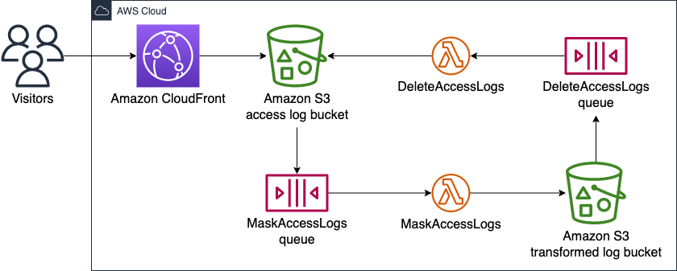

+++
title = "アクセスログの分析(1. マスキング編)"
description = "シリーズ:当ウェブサイトのアクセスログの解析について"
date = 2022-11-02
draft = false
[extra]
hashtags = ["AWS", "CloudFront", "GDPR"]
thumbnail_name = "thumbnail.jpg"
+++

このブログ投稿では私のウェブサイトのCloudFrontアクセスログからどのようにして個人データを減らしているかを紹介します。
これはアクセスログ分析に関するシリーズの最初の投稿です。

<!-- more -->

## 背景

私にとって、私のウェブサイトの閲覧者を知ることは重要です。
誰が見ているのかを特定する必要はありませんが、大まかにどのような閲覧者たちなのかは知りたいところです。
このウェブサイトは[Amazon CloudFront (CloudFront)](https://aws.amazon.com/cloudfront/)のDistributionを介して配信しており、CloudFrontがアクセスログを記録しています。
ということでこれらのアクセスログを分析することが閲覧者を理解\*する最初のステップです。
[CloudFrontがどのパラメータをアクセスログに含むか](https://docs.aws.amazon.com/AmazonCloudFront/latest/DeveloperGuide/AccessLogs.html#LogFileFormat)をコントロールすることはできませんが、我々の集めるアクセスログが[General Data Protection Regulation (GDPR)](https://gdpr-info.eu)[\[1\]](#参考)\*2に確実に準拠するようにしなければなりません。
このブログでは、個人データを減らすためにCloudFrontアクセスログを変換するAWS上の私のアーキテクチャを紹介します。

\* [Googleアナリティクス](https://analytics.google.com/analytics/)を提案する方もいらっしゃるかもしれませんが、Googleアナリティクスは私が必要とするよりはるかに詳細な(不要な)情報を集めてしまいます。
また、Googleアナリティクスやその類を採用することで不気味なCookieを導入したくもありません。
[GoogleアナリティクスはGDPR準拠に関する課題も抱えています](https://piwik.pro/blog/is-google-analytics-gdpr-compliant/)[\[2\]](#参考)。

\*2 このウェブサイトで集める情報を用いて皆さんに何か危害を加えることができるとは思いませんが、何にせよ不要な情報は集めるべきではありません。

## CloudFrontアクセスログはGDPRに準拠している?

答えは**ダメ**そうです。
[CloudFrontアクセスログの個々のカラム](https://docs.aws.amazon.com/AmazonCloudFront/latest/DeveloperGuide/AccessLogs.html#LogFileFormat)では個人を特定することはできないかもしれません。
しかし、CloudFrontアクセスログ内のIPアドレスやUser-Agentなどのカラムを組み合わせると、個人を特定\*してその人をトラッキングすることができてしまいそうです。
[こちらの記事](https://cloudonaut.io/anonymize-cloudfront-access-logs/)[\[3\]](#参考)によると、CloudFrontアクセスログを長期間保管したい場合は最低限そこに含まれるIPアドレスからある程度のビットを落とす必要がありそうです。
ここで紹介することは本質的にはその記事[\[3\]](#参考)に記載されていることと同じです。

\* ここで「特定」するとは、その人の名前、電子メール、連絡先などを知ることではなく、ある人をその人が正確に誰であるかを知ることなく他の人から区別するということです。

### 免責

私は法曹の者ではなく、
**これは法的なアドバイスではありません**。

## 私のアーキテクチャの概要

以下の図にAWS上の私のアーキテクチャを示します。



ワークフローは以下の通りです。
1. [`Amazon CloudFront`](#Amazon_CloudFront)がアクセスログファイルを[`Amazon S3 access log bucket`](#Amazon_S3_access_log_bucket)に保存。
2. [`Amazon S3 access log bucket`](#Amazon_S3_access_log_bucket)がPUTイベントを[`MaskAccessLogs queue`](#MaskAccessLogs_queue)に送信。
3. [`MaskAccessLogs queue`](#MaskAccessLogs_queue)が[`MaskAccessLogs`](#MaskAccessLogs)を呼び出し。
4. [`MaskAccessLogs`](#MaskAccessLogs)が新しいアクセスログファイルを変換し、結果を[`Amazon S3 transformed log bucket`](#Amazon_S3_transformed_log_bucket)に保存。
5. [`Amazon S3 transformed log bucket`](#Amazon_S3_transformed_log_bucket)がPUTイベントを[`DeleteAccessLogs queue`](#DeleteAccessLogs_queue)に送信。
6. [`DeleteAccessLogs queue`](#DeleteAccessLogs_queue)が[`DeleteAccessLogs`](#DeleteAccessLogs)を呼び出し。
7. [`DeleteAccessLogs`](#DeleteAccessLogs)がオリジナルのアクセスログファイルを[`Amazon S3 access log bucket`](#Amazon_S3_access_log_bucket)から削除。

このウェブサイトのために上記のアーキテクチャ\*を確保する[AWS Cloud Development Kit (CDK)](https://aws.amazon.com/cdk/)スタックが[私のGitHubレポジトリ](https://github.com/codemonger-io/codemonger/tree/e7562e9197a71cd914e1b8e4c964ca0adc74a859/cdk-ops)にあります(特に、[cdk-ops/lib/access-logs-etl.ts](https://github.com/codemonger-io/codemonger/blob/e7562e9197a71cd914e1b8e4c964ca0adc74a859/cdk-ops/lib/access-logs-etl.ts))。
CDK特有の課題がありましたが、詳しくは[節「CloudFrontアクセスログ用のS3バケットを特定する」](#CloudFrontアクセスログ用のS3バケットを特定する)をご参照ください。

以下の小節では上図の各コンポーネントを解説します。

\* 私のGitHubレポジトリの最新コードはデータウェアハウスなどの追加の機能も含んでいます。

### Amazon CloudFront

`Amazon CloudFront`は我々のウェブサイトのコンテンツを[Amazon CloudFront](https://aws.amazon.com/cloudfront/)のDistributionを通じて配信しており、アクセスログを[`Amazon S3 access log bucket`](#Amazon_S3_access_log_bucket)に保存します。

### Amazon S3 access log bucket

`Amazon S3 access log bucket`は[`Amazon CloudFront`](#Amazon_CloudFront)が作成したアクセスログを保管する[Amazon S3 (S3)](https://aws.amazon.com/s3/)バケットです。
このバケットはアクセスログファイルがPUTされると[`MaskAccessLogs queue`](#MaskAccessLogs_queue)にイベントを送信します。

### MaskAccessLogs queue

`MaskAccessLogs queue`は[Amazon Simple Queue Service (SQS)](https://docs.aws.amazon.com/AWSSimpleQueueService/latest/SQSDeveloperGuide/welcome.html)のキューで[`MaskAccessLogs`](#MaskAccessLogs)を呼び出します。
[`Amazon S3 access log bucket`](#Amazon_S3_access_log_bucket)はアクセスログファイルがPUTされるとこのキューにイベントを送信します。

[`Amazon S3 access log bucket`](#Amazon_S3_access_log_bucket)から[`MaskAccessLogs`](#MaskAccessLogs)に直接イベントを届けることもできますが、そうはしませんでした。
理由については[節「なぜS3バケットとLambda関数を直接つながないのか?」](#なぜS3バケットとLambda関数を直接つながないのか?)をご参照ください。

### MaskAccessLogs

`MaskAccessLogs`は[AWS Lambda (Lambda)](https://docs.aws.amazon.com/lambda/latest/dg/welcome.html)関数で、[`Amazon S3 access log bucket`](#Amazon_S3_access_log_bucket)のアクセスログを変換します。
この関数は[CloudFrontアクセスログ](https://docs.aws.amazon.com/AmazonCloudFront/latest/DeveloperGuide/AccessLogs.html#LogFileFormat)内のIPアドレス(`c-ip`と`x-forwarded-for`)をマスクします。
以下を落とし(ゼロで埋め)ます。
- IPv4アドレス32ビット中の8最下位ビット(LSB)
- IPv6アドレス128ビット中の96 LSB

この関数はアクセスログレコードの元々の順番を保つために行番号を含む新しいカラムも導入します。
この関数は変換結果を[`Amazon S3 transformed log bucket`](#Amazon_S3_transformed_log_bucket)に保存します。
[`Amazon S3 access log bucket`](#Amazon_S3_access_log_bucket)はアクセスログファイルをフラットに展開しますが、この関数はアクセスログレコードの年月日に対応するフォルダ階層を作成します。
このフォルダ構造は後続のステージ\*が特定の日付のアクセスログをバッチで処理する際に役立ちます。

この関数の実装は[私のGitHubレポジトリ(cdk-ops/lambda/mask-access-logs/index.py)](https://github.com/codemonger-io/codemonger/blob/e7562e9197a71cd914e1b8e4c964ca0adc74a859/cdk-ops/lambda/mask-access-logs/index.py)にあります。

\* 今後のブログ投稿で、アクセスログをデータウェアハウスにロードする後のステージを解説する予定です。

### Amazon S3 transformed log bucket

`Amazon S3 transformed log bucket`は[`MaskAccessLogs`](#MaskAccessLogs)が変換したアクセスログを格納するS3バケットです。
このバケットは変換したアクセスログファイルがPUTされると[`DeleteAccessLogs queue`](#DeleteAccessLogs_queue)にイベントを送信します。

### DeleteAccessLogs queue

`DeleteAccessLogs queue`はSQSキューで、[`DeleteAccessLogs`](#DeleteAccessLogs)を呼び出します。
[`Amazon S3 transformed log bucket`](#Amazon_S3_transformed_log_bucket)は変換されたアクセスログファイルがPUTされるとこのキューにイベントを送信します。

[`Amazon S3 transformed log bucket`](#Amazon_S3_transformed_log_bucket)から[`DeleteAccessLogs`](#DeleteAccessLogs)に直接イベントを届けることもできますが、そうはしませんでした。
理由については[節「なぜS3バケットとLambda関数を直接つながないのか?」](#なぜS3バケットとLambda関数を直接つながないのか?)をご参照ください。

### DeleteAccessLogs

`DeleteAccessLogs`はLambda関数で、[`MaskAccessLogs`](#MaskAccessLogs)が変換し[`Amazon S3 transformed log bucket`](#Amazon_S3_transformed_log_bucket)に保存済みのアクセスログファイルを[`Amazon S3 access log bucket`](#Amazon_S3_access_log_bucket)から削除します。

この関数の実装は[私のGitHubレポジトリ(cdk-ops/lambda/delete-access-logs/index.py)](https://github.com/codemonger-io/codemonger/blob/e7562e9197a71cd914e1b8e4c964ca0adc74a859/cdk-ops/lambda/delete-access-logs/index.py)にあります。

## まとめ

このブログでは、[**CloudFrontアクセスログを長期間保存することはGDPRに違反する可能性があること**](#CloudFrontアクセスログはGDPRに準拠している?)を学びました。
そして、[**CloudFrontアクセスログから個人データを減らす**ためのAWSアーキテクチャ](#私のアーキテクチャの概要)を紹介しました。

今後のブログ投稿では、[Amazon Redshift Serverless](https://aws.amazon.com/redshift/redshift-serverless/)を用いたデータウェアハウスにアクセスログを読み込む方法を紹介する予定です。

## 補足

### CloudFrontアクセスログ用のS3バケットを特定する

CloudFrontのDistribution([`cloudfront.Distribution (Distribution)`](https://docs.aws.amazon.com/cdk/api/v2/docs/aws-cdk-lib.aws_cloudfront.Distribution.html))を確保する際に、[ログを有効化](https://docs.aws.amazon.com/cdk/api/v2/docs/aws-cdk-lib.aws_cloudfront.DistributionProps.html#enablelogging)した上で[アクセスログ用のS3バケット](https://docs.aws.amazon.com/cdk/api/v2/docs/aws-cdk-lib.aws_cloudfront.Distribution.html#logbucket)を省略した場合、CDKが代わりにバケットを確保してくれます。
これを行った場合の問題点はCDKが確保するS3バケットの所在を我々で管理できないということです。
残念ながら、L2 Construct(`Distribution`)はアクセスログ用のS3バケット名を取得する手軽な方法を用意しておらず、CloudFront DistributionのL1レイヤー([`cloudfront.CfnDistribution (CfnDistribution)`](https://docs.aws.amazon.com/cdk/api/v2/docs/aws-cdk-lib.aws_cloudfront.CfnDistribution.html))まで潜らなければなりません。
アクセスログ用のS3バケット名を抽出するには次のように辿る必要があります。`Distribution` &rightarrow; `CfnDistribution` &rightarrow; [`CfnDistribution#distributionConfig`](https://docs.aws.amazon.com/cdk/api/v2/docs/aws-cdk-lib.aws_cloudfront.CfnDistribution.html#distributionconfig-1) &rightarrow; [`CfnDistribution.DistributionConfigProperty#logging`](https://docs.aws.amazon.com/cdk/api/v2/docs/aws-cdk-lib.aws_cloudfront.CfnDistribution.DistributionConfigProperty.html#logging) &rightarrow; [`CfnDistribution.LoggingProperty#bucket`](https://docs.aws.amazon.com/cdk/api/v2/docs/aws-cdk-lib.aws_cloudfront.CfnDistribution.LoggingProperty.html#bucket)。

以下は`Distribution`からアクセスログ用のS3バケット名を抽出するためのステップです。
1. `distribution: Distribution`と仮定。

2. `distribution.node.defaultChild`を`CfnDistribution`にキャスト。
    ```ts
    cfnDistribution = distribution.node.defaultChild as cloudfront.CfnDistribution;
    ```

3. `cfnDistribution.distributionConfig`を解決。
   `cfnDistribution.distributionConfig`を`CfnDistribution.DistributionConfigProperty`として単純に参照することはできません。なぜなら[`IResolvable`](https://docs.aws.amazon.com/cdk/api/v2/docs/aws-cdk-lib.IResolvable.html)かもしれないからです。
    ```ts
    stack = Stack.of(distribution);
    distributionConfig = stack.resolve(cfnDistribution.distributionConfig) as CfnDistribution.DistributionConfigProperty;
    ```

4. `distributionConfig.logging`を解決。
   `distributionConfig.logging`も`IResolvable`かもしれないので`CfnDistribution.LoggingProperty`として単純に参照することはできません。
    ```ts
    loggingConfig = stack.resolve(distributionConfig.logging) as CfnDistribution.LoggingProperty;
    ```

5. S3バケットのロジカルID(CloudFormationテンプレート内におけるID)を`loggingConfig.bucket`から抽出。
   私の観察と[CDKのソースコード](https://github.com/aws/aws-cdk/blob/7d8ef0bad461a05caa41d140678481c5afb9d33e/packages/%40aws-cdk/aws-cloudfront/lib/distribution.ts#L443-L457)によれば、`loggingConfig.bucket`はS3バケットのリージョナルドメイン名を取得する[組み込み関数`Fn::GetAtt`](https://docs.aws.amazon.com/AWSCloudFormation/latest/UserGuide/intrinsic-function-reference-getatt.html)です。
   ということでS3バケット名を参照する前にロジカルIDを抽出します。
    ```ts
    bucketRef = loggingConfig.bucket;
    getAtt = bucketRef['Fn::GetAtt'];
    bucketLogicalId = getAtt[0];
    ```

6. `bucketLogicalId`で示されるS3バケット名を参照。
    ```ts
    accessLogsBucketName = Fn.ref(bucketLogicalId);
    ```

上記ステップの実装は[私のGitHubレポジトリ(cdk/lib/contents-distribution.ts#L122-L154)](https://github.com/codemonger-io/codemonger/blob/e7562e9197a71cd914e1b8e4c964ca0adc74a859/cdk/lib/contents-distribution.ts#L122-L154)にあります。

とはいえ、自分でアクセスログ保存先のS3バケットを用意する方がよっぽど楽でしょうね・・・

### なぜS3バケットとLambda関数を直接つながないのか?

S3バケットに対する変更がLambda関数をトリガーするようにS3バケットとLambda関数をイベント通知で直接接続することもできます。
やり方については["Using AWS Lambda with Amazon S3," _AWS Lambda Developer Guide_](https://docs.aws.amazon.com/lambda/latest/dg/with-s3.html)[\[4\]](#参考)を参照してください。
ところが、[私のAWSアーキテクチャ](#私のアーキテクチャの概要)ではご覧のとおり、S3バケットとLambda関数を直接接続する代わりに追加のSQSキューを間に挟むことにしました([`Amazon S3 access log bucket`](#Amazon_S3_access_log_bucket) &rightarrow; [**`MaskAccessLogs queue`**](#MaskAccessLogs_queue) &rightarrow; [`MaskAccessLogs`](#MaskAccessLogs)および[`Amazon S3 transformed log bucket`](#Amazon_S3_transformed_log_bucket) &rightarrow; [**`DeleteAccessLogs queue`**](#DeleteAccessLogs_queue) &rightarrow; [`DeleteAccessLogs`](#DeleteAccessLogs))。
一段複雑になりますが、何か問題が起きた際にLambda関数の呼び出しを簡単にON/OFFできるようになります。
さもなくば、イベントの流れを切断するためにLambda関数からイベントトリガーを削除しなければなりません。

## 参考

1. [_General Data Protection Regulation (GDPR) Compliance Guidelines_ - https://gdpr.eu](https://gdpr.eu)
2. [_Is Google Analytics (3 &amp; 4) GDPR-compliant? \[Updated\] - https://piwik.pro/blog/is-google-analytics-gdpr-compliant/_](https://piwik.pro/blog/is-google-analytics-gdpr-compliant/)
3. [_Anonymize CloudFront Access Logs_ - https://cloudonaut.io/anonymize-cloudfront-access-logs/](https://cloudonaut.io/anonymize-cloudfront-access-logs/)
4. ["Using AWS Lambda with Amazon S3," _AWS Lambda Developer Guide_ - https://docs.aws.amazon.com/lambda/latest/dg/with-s3.html](https://docs.aws.amazon.com/lambda/latest/dg/with-s3.html)