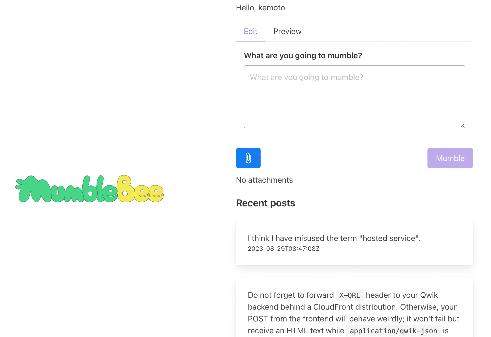

+++
title = "MumbleBee"
description = "Mumbleの公式クライアント"
date = 2023-06-20
updated = 2023-08-30
draft = false
weight = 3
[extra]
hashtags = ["Mumble"]
thumbnail_name = "mumble-bee-brand.png"
+++

Mumbleの公式クライアント

<!-- more -->

**MumbleBee**は[Mumble](./mumble/)([ActivityPub](https://activitypub.rocks)のサーバーレス実装)の公式クライアントです。

## 機能

- [Mumble](../mumble/)にサインイン
- [Mumble](../mumble/)で投稿する(_ゴニョる_)
    - [マークダウン](https://ja.wikipedia.org/wiki/Markdown)サポート
    - 添付ファイル
- 投稿(_ゴニョゴニョ_)のタイムラインを表示

今後の機能追加やUI/UXの改善にご期待ください!

## 始め方

MumbleBeeはクラウドサービスではなく、AWSインフラのレシピを含むソフトウェアパッケージです。
でも、[AWS](https://aws.amazon.com)と[AWS Cloud Development Kt (CDK)](https://aws.amazon.com/cdk/)の経験があれば簡単に[AWS](https://aws.amazon.com)アカウントにデプロイできます。
MumbleBeeのデプロイ方法など詳しくは[GitHubレポジトリ(https://github.com/codemonger-io/mumble-bee)](https://github.com/codemonger-io/mumble-bee)をご覧ください。

MumbleBeeの前に[Mumble](../mumble/)もデプロイする必要があります。