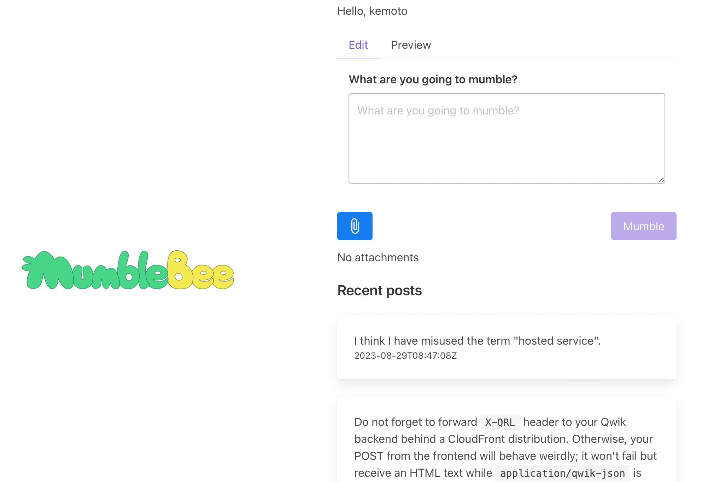

+++
title = "MumbleBee"
description = "Official client of Mumble"
date = 2023-06-20
updated = 2023-08-30
draft = false
weight = 2
[extra]
hashtags = ["Mumble"]
thumbnail_name = "mumble-bee-brand.png"
+++

The official client of Mumble

<!-- more -->

**MumbleBee** is the official client of [Mumble](./mumble/) which is a serverless implementation of [ActivityPub](https://activitypub.rocks).

## Features

- Sign in to [Mumble](../mumble/)
- Publish posts (_mumble_) through [Mumble](../mumble/)
    - [Markdown](https://en.wikipedia.org/wiki/Markdown) support
    - Optional attachments
- View your post (_mumbling_) timeline

Other features and UI/UX improvements are coming!

## How to get started

MumbleBee is not a cloud service but a software package including the recipe for the AWS infrastructure.
However, you can easily deploy it to your [AWS](https://aws.amazon.com) account if you have some experience with [AWS](https://aws.amazon.com) and [AWS Cloud Development Kt (CDK)](https://aws.amazon.com/cdk/).
Please refer to the [GitHub repository (https://github.com/codemonger-io/mumble-bee)](https://github.com/codemonger-io/mumble-bee) for how to deploy MumbleBee and more details.

You also have to deploy [Mumble](../mumble/) prior to MumbleBee.