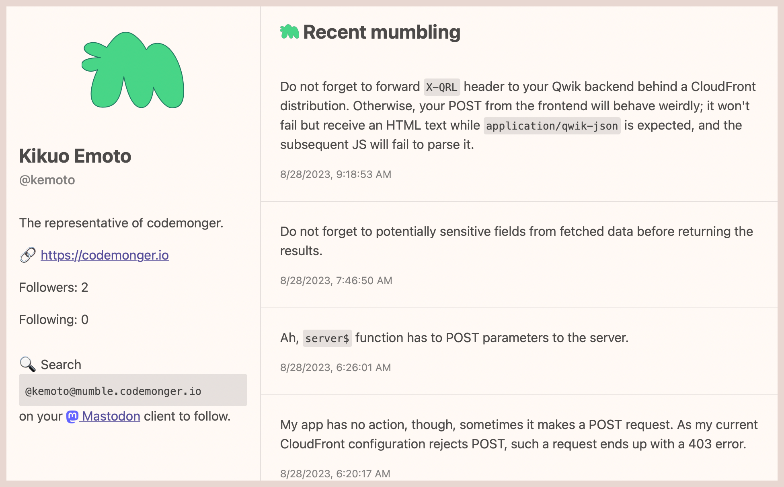

+++
title = "Mumble"
description = "ActivityPubのサーバーレス実装"
date = 2023-06-20
updated = 2023-08-30
draft = false
weight = 1
[extra]
hashtags = ["Mumble", "ActivityPub", "serverless"]
thumbnail_name = "mumble-brand.png"
+++

ActivityPubのサーバーレス実装

<!-- more -->

**Mumble**は[ActivityPub](https://activitypub.rocks)のサーバーレス実装で、[Mastodon](https://joinmastodon.org/)など他の対応サーバーとコミュニケーションができます。

## 機能と特徴

- [ActivityPub](https://activitypub.rocks)の基本機能
    - 投稿する(_ゴニョる_)
        - 今のところ公開の投稿(_ゴニョゴニョ_)のみ
        - 添付ファイル
    - フォロワーに*ゴニョゴニョ*を届ける
- [Mastodon](https://joinmastodon.org/)とコミュニケーションする
    - Mumbleアカウントは[Mastodon](https://joinmastodon.org/)ユーザが検索・フォローできます。
- AWS上の[サーバーレス技術](https://aws.amazon.com/serverless/)で構成
    - ほとんど**コストゼロ**で始めることができ、アクセスが増えるにつれて**スケール**することができます!
- ゲスト用の[ビューワーアプリ](#ビューワーアプリ)
    - プロフィールページのURLをシェアしてMumbleアカウントをプロモーションできます。

今後の機能追加にもご期待ください!

## 始め方

Mumble自体はクラウドサービスではなく、AWSインフラのレシピを含むソフトウェアパッケージです。
でも、[AWS](https://aws.amazon.com)と[AWS Cloud Development Kt (CDK)](https://aws.amazon.com/cdk/)の経験があれば簡単に[AWS](https://aws.amazon.com)アカウントにデプロイできます。
Mumbleのデプロイ方法については[GitHubレポジトリ](https://github.com/codemonger-io/mumble)をご覧ください。

## ビューワーアプリ

プロフィールと公開の*ゴニョゴニョ*はビューワーアプリで誰でも見ることができます。
URLをソーシャルメディアのプロフィールに加えてMumbleアカウントをプロモーションしましょう。

以下は私(Kikuo)のプロフィールページ([https://mumble.codemonger.io/viewer/users/kemoto/](https://mumble.codemonger.io/viewer/users/kemoto/))のスクリーンショットです。

## クライアント

Mumbleで*ゴニョる*には、クライアントアプリが必要です。
[MumbleBee](../mumble-bee/)が公式クライアントです。

## 背景

仕事中によく自分の考えや気づきなどを短いテキスト(_ゴニョゴニョ_)に書き出します。
これをするのに、[Microsoft Teams](https://www.microsoft.com/en-us/microsoft-teams/group-chat-software)や[Slack](https://slack.com/), [Dicord](https://discord.com)など、何かしら職場で利用できるものを使っていました。
そんな*ゴニョゴニョ*は後で同僚や自分にとって役立つことがよくありました。
フリーランスになった今、そんな*ゴニョゴニョ*を公に書き出せる自分専用の場所が欲しくなってきました。
[Twitter](https://twitter.com)を使えばいいのかもしれませんが、どうにも私には馴染まないと感じていました。
最近の[Twitter](https://twitter.com)周りのゴタゴタの折、分散型ソーシャルネットワークの[Mastodon](https://joinmastodon.org)が気になり、その[Mastodon](https://joinmastodon.org)を裏で支える[ActivityPub](https://www.w3.org/TR/activitypub/)に興味を持ち始めました。
[Mastodon](https://joinmastodon.org)をホストするには従来型のサーバー諸々が必要ですが、それはあまり私が追求したい道ではなかったので、自分で[AWS](https://aws.amazon.com)上にサーバーレス版の[ActivityPub](https://www.w3.org/TR/activitypub/)サービスを実装することにしました。

## GitHubレポジトリ

Mumbleのデプロイ方法など詳しくは[GitHubレポジトリ(https://github.com/codemonger-io/mumble)](https://github.com/codemonger-io/mumble)をご覧ください。