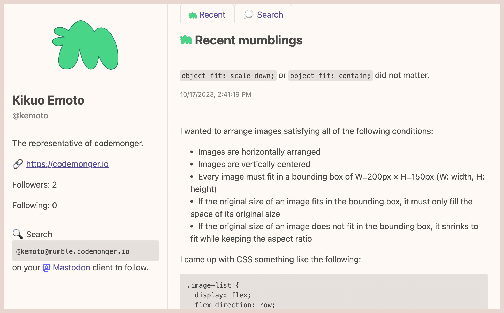

+++
title = "Mumble"
description = "Serverless implementation of ActivityPub"
date = 2023-06-20
updated = 2023-10-19
draft = false
weight = 1
[extra]
hashtags = ["Mumble", "ActivityPub", "serverless"]
thumbnail_name = "mumble-brand.png"
+++

A serverless implementation of ActivityPub

<!-- more -->

**Mumble** is a serverless implementation of [ActivityPub](https://activitypub.rocks) that can communicate with other compliant servers such as [Mastodon](https://joinmastodon.org/).

## Features

- Basic features of [ActivityPub](https://activitypub.rocks)
    - Publish post (_mumble_)
        - Only public post (_mumbling_) so far
        - Optional attachments
    - Deliver _mumblings_ to your followers
- Communication with [Mastodon](https://joinmastodon.org/)
    - Your Mumble account may be reached and followed by [Mastodon](https://joinmastodon.org/) users.
- Built with [serverless technologies](https://aws.amazon.com/serverless/) on AWS
    - You can start it with almost **zero cost** and **scale** it as you gain traffic!
- [Built-in viewer app](#Viewer_app) for guests
    - You can promote your Mumble account by sharing your profile URL.
    - Guests can search your mumblings with free-form texts.

More features are coming!

## How to get started

Mumble itself is not a cloud service but a software package including the recipe for the AWS infrastructure.
However, you can easily deploy it to your [AWS](https://aws.amazon.com) account if you have some experience with [AWS](https://aws.amazon.com) and [AWS Cloud Development Kt (CDK)](https://aws.amazon.com/cdk/).
Please refer to the [GitHub repository](https://github.com/codemonger-io/mumble) for how to deploy Mumble.

## Viewer app

Any guests can view your profile and public _mumblings_ on the built-in viewer app.
Include its URL in your social media profile to promote your Mumble account.
Guests can also search your mumblings with free-form texts on the search page powered by [FlechasDB](../flechasdb/), and [OpenAI's embeddings](https://platform.openai.com/docs/models/embeddings).

Here is a screenshot of Kikuo's profile page ([https://mumble.codemonger.io/viewer/users/kemoto/](https://mumble.codemonger.io/viewer/users/kemoto/)):

## Client

To _mumble_ on Mumble, you need a client app.
There is an official client [MumbleBee](../mumble-bee/).

## Background

I often write down thoughts and findings in short texts (_mumblings_) while I am working.
For that purpose, I used to use [Microsoft Teams](https://www.microsoft.com/en-us/microsoft-teams/group-chat-software), [Slack](https://slack.com/), [Discord](https://discord.com), or whatever the workplace provided.
These _mumblings_ often turned out useful for my colleagues and me later.
Now, as a freelance, I started to want to have my own place to publicly write down these _mumblings_.
[Twitter](https://twitter.com) could have been a good place, but I felt somehow it was not the right place for me.
During the recent turmoil around [Twitter](https://twitter.com), [Mastodon](https://joinmastodon.org), a decentralized social network, caught my attention, and I was attracted to [ActivityPub](https://activitypub.rocks) behind [Mastodon](https://joinmastodon.org).
Since hosting [Mastodon](https://joinmastodon.org) required a traditional setup of servers that was not the way I was eager to pursue, I decided to implement a serverless version of [ActivityPub](https://activitypub.rocks) on [AWS](https://aws.amazon.com).

## GitHub repository

Please refer to the [GitHub repository (https://github.com/codemonger-io/mumble)](https://github.com/codemonger-io/mumble) for how to deploy Mumble and more details.